# 🏦 BankApp Microservices


> **Enterprise-oriented banking management platform built with Java 17, Spring Boot, Spring Cloud, Keycloak, OAuth2/JWT, PostgreSQL, Liquibase, IBM MQ, Docker, React and TypeScript.**

🌐 **Live Demo:**
https://cddd48c5.bankapp-frontend-606.pages.dev

💻 **Backend Repository:**
https://github.com/youssefJmaiel/bankapp-microservice

💻 **Frontend Repository:**
https://github.com/youssefJmaiel/bankapp-frontend

---

# 📌 Overview

**BankApp Microservices** is a full-stack banking management platform designed around a distributed **microservices architecture**.

The backend is built with **Java 17, Spring Boot and Spring Cloud**, while the frontend is implemented with **React and TypeScript**.

The platform demonstrates how independent business services can be:

* secured with Keycloak and OAuth2/JWT;
* discovered dynamically through Eureka;
* exposed through a centralized API Gateway;
* persisted using PostgreSQL;
* versioned with Liquibase;
* integrated with IBM MQ for asynchronous messaging;
* containerized with Docker;
* consumed by a modern React frontend.

The project combines **synchronous REST communication** with **asynchronous enterprise messaging**.

---

# ✨ Main Features

* 🔐 Keycloak authentication
* 🪪 OAuth2 / JWT security
* 👑 Role-Based Access Control
* 👥 Employee management
* 🏢 Department management
* 🎯 Mission management
* 🤝 Partner management
* 📨 Banking message management
* 📬 Personal user message inbox
* 📨 IBM MQ asynchronous messaging
* 🌐 Spring Cloud Gateway
* 🔎 Eureka service discovery
* 🗄️ PostgreSQL persistence
* 🔄 Liquibase migrations
* 🐳 Docker / Docker Compose
* 📚 Swagger / OpenAPI
* 🧪 Unit and integration-oriented testing
* ⚛️ React + TypeScript frontend
* ☁️ Cloudflare Pages deployment

---

# 🏗️ System Architecture

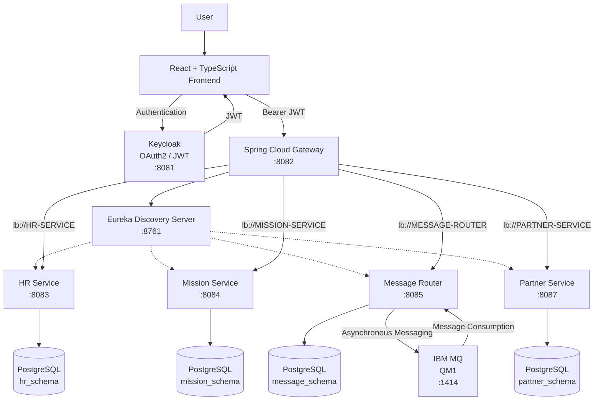

---

# 🔄 End-to-End Request Flow

The frontend uses the **API Gateway as the central backend entry point**.

```text
                         ┌──────────────┐
                         │   Keycloak   │
                         │    :8081     │
                         └──────┬───────┘
                                │
                              JWT
                                │
                                ▼
┌────────────────┐      ┌────────────────┐
│ React Frontend │─────▶│ API Gateway    │
│   TypeScript   │      │     :8082      │
└────────────────┘      └───────┬────────┘
                                │
                                ▼
                         ┌──────────────┐
                         │    Eureka    │
                         │    :8761     │
                         └──────┬───────┘
                                │
          ┌─────────────────────┼─────────────────────┐
          │                     │                     │
          ▼                     ▼                     ▼
     HR Service          Mission Service       Message Router
       :8083                  :8084                 :8085
          │                     │                     │
          │                     │                     ├── PostgreSQL
          │                     │                     │
          │                     │                     └── IBM MQ
          │                     │
          │                     ▼
          │                 PostgreSQL
          │
          ▼
      PostgreSQL

                                │
                                ▼
                         Partner Service
                              :8087
                                │
                                ▼
                           PostgreSQL
```

---

# 🔐 Authentication & Security

The application uses **Keycloak** as the centralized identity and access management system.

Authentication is based on:

```text
Keycloak
   │
   ▼
OAuth2
   │
   ▼
JWT Access Token
   │
   ▼
Spring Security
   │
   ▼
Protected Microservice
```

Authenticated API requests contain:

```http
Authorization: Bearer <JWT_TOKEN>
```

Each protected backend service validates the JWT using its configured Keycloak issuer/JWK configuration.

The backend remains responsible for enforcing authorization.

---

# 👤 Employee Account Creation & Activation

Employee creation in the HR service is connected to Keycloak account provisioning.

## Workflow

1. An administrator submits an employee creation request through the HR functionality.
2. `EmployeeService` converts the request and saves the employee record.
3. `KeycloakAdminService` obtains an administrative access token using the configured Keycloak client credentials.
4. A Keycloak user is created using the employee's email address as the username, with the employee's name and email details.
5. The new account is enabled, the email is initially unverified, and the `USER` realm role is assigned.
6. Keycloak is asked to send an activation email with the required actions `VERIFY_EMAIL` and `UPDATE_PASSWORD`.
7. The activation link is configured to expire after 24 hours.
8. The employee verifies the email address and sets a password before signing in.

If provisioning fails after a Keycloak user has been created, the service attempts to remove that Keycloak user and reports the error.

> **Email distinction:** this activation email is sent through Keycloak. It is separate from the standalone BankApp Notification microservice documented below; automatic invocation of that notification service during employee creation has not been confirmed.

---

# 👑 Role-Based Access Control

The main application roles are:

```text
ADMIN
USER
```

The project follows a defense-in-depth approach:

```text
Frontend role-based visibility
            +
Backend Spring Security
            +
Keycloak JWT
            =
Protected application
```

Frontend restrictions improve the user experience, but they are **not considered a security boundary**.

The backend independently validates permissions.

---

# 👑 ADMIN Permissions

The administrator has management access to the main business modules.

### Employees

* View employees
* Create employees
* Update employees
* Delete employees

### Departments

* View departments
* Create departments
* Update departments
* Delete departments

### Missions

* View missions
* Create missions
* Update missions
* Delete missions
* Assign missions to employees

### Partners

* View partners
* Create partners
* Delete partners

### Messages

* View banking messages
* Send banking messages
* Delete messages
* Use the messaging workflow integrated with IBM MQ

---

# 👤 USER Permissions

Standard users have consultation and personal-access permissions.

Users can:

* View employees
* View departments
* View missions
* View partners
* Access their personal message inbox
* Read messages addressed to their authenticated username

Users cannot:

* Create employees
* Update employees
* Delete employees
* Create departments
* Update departments
* Delete departments
* Create missions
* Update missions
* Delete missions
* Create partners
* Delete partners
* Send banking messages
* Delete messages
* Access administrative message collections

---

# 📨 Personal Message Inbox

The application provides a dedicated personal messaging endpoint:

```http
GET /api/messages/my
```

The Message Router extracts the authenticated user's username from the JWT:

```text
preferred_username
```

The backend then returns only messages addressed to that user.

Example:

```text
JWT
 │
 └── preferred_username = john
                │
                ▼
       GET /api/messages/my
                │
                ▼
       receiver = "john"
                │
                ▼
        Personal messages
```

This prevents standard users from accessing the complete administrative message collection.

---

# 🤝 Partner Management

Partner management is implemented as an **independent microservice**.

```text
Partner Service
      │
      ├── Spring Boot
      ├── Spring Security
      ├── JWT / Keycloak
      ├── Eureka
      ├── PostgreSQL
      └── Liquibase
```

The Partner Service runs on:

```text
8087
```

Its API is:

```text
/api/partners/**
```

The frontend does **not** call port `8087` directly.

Instead:

```text
React Frontend
      │
      ▼
Gateway :8082
      │
      ▼
Eureka
      │
      ▼
PARTNER-SERVICE :8087
```

This keeps Partner consistent with the rest of the microservice architecture.

---

# 🌐 API Gateway

Spring Cloud Gateway provides the central entry point for frontend API requests.

## Gateway Routes

| Frontend API        | Destination       |
| ------------------- | ----------------- |
| `/api/employees/**` | `HR-SERVICE`      |
| `/api/missions/**`  | `MISSION-SERVICE` |
| `/api/messages/**`  | `MESSAGE-ROUTER`  |
| `/api/partners/**`  | `PARTNER-SERVICE` |

The Gateway uses Eureka service discovery and logical service names:

```text
lb://HR-SERVICE
lb://MISSION-SERVICE
lb://MESSAGE-ROUTER
lb://PARTNER-SERVICE
```

Therefore, the frontend does not need to know the internal service addresses.

---

# 🔎 Eureka Service Discovery

The Discovery Server uses **Netflix Eureka** to register and discover microservices dynamically.

```text
                     Eureka :8761
                           │
        ┌──────────────────┼───────────────────┐
        │                  │                   │
        ▼                  ▼                   ▼
   HR-SERVICE       MISSION-SERVICE     MESSAGE-ROUTER
      :8083              :8084               :8085

                           │
                           ▼
                    PARTNER-SERVICE
                         :8087
```

This allows the Gateway to route requests without hard-coding individual container IP addresses.

---

# 🧩 Microservices

| Service              |   Port | Responsibility                  |
| -------------------- | -----: | ------------------------------- |
| **Gateway Service**  | `8082` | Central API Gateway and routing |
| **HR Service**       | `8083` | Employees and departments       |
| **Mission Service**  | `8084` | Mission management              |
| **Message Router**   | `8085` | Banking messages and IBM MQ     |
| **Partner Service**  | `8087` | Partner management              |
| **Discovery Server** | `8761` | Eureka service discovery        |
| **Keycloak**         | `8081` | Authentication and identity     |
| **IBM MQ**           | `1414` | Asynchronous messaging          |

Additional project modules are present in the repository for shared infrastructure and application components.

---

# 🗂️ Service Responsibilities

## 👥 HR Service

The HR Service manages:

```text
Employees
Departments
```

Database schema:

```text
hr_schema
```

Main responsibilities:

* Employee management
* Department management
* Validation
* REST APIs
* JWT authorization
* PostgreSQL persistence
* Liquibase migrations

---

## 🎯 Mission Service

The Mission Service manages:

```text
Missions
Employee assignments
```

Database schema:

```text
mission_schema
```

Mission assignments use an employee identifier:

```text
assignedEmployeeId
```

The Mission Service does not maintain a direct database foreign key to the HR Service.

This preserves the independence of the microservices.

---

## 📨 Message Router

The Message Router is responsible for:

```text
Banking Messages
IBM MQ integration
Message production
Message consumption
```

Database schema:

```text
message_schema
```

The Message Router combines:

```text
REST API
    +
PostgreSQL
    +
IBM MQ
```

---

## 🤝 Partner Service

The Partner Service is responsible exclusively for:

```text
Partner Management
```

Database schema:

```text
partner_schema
```

The service provides:

* Partner consultation
* Paginated partner consultation
* Partner details
* Partner creation
* Partner deletion
* JWT authorization
* Role-based access control
* PostgreSQL persistence
* Liquibase migrations
* Eureka registration

Partner APIs:

```text
GET    /api/partners
GET    /api/partners/paged
GET    /api/partners/{id}
POST   /api/partners
DELETE /api/partners/{id}
```

---

# 📨 IBM MQ — Asynchronous Messaging

The Message Router integrates **IBM MQ** to demonstrate enterprise asynchronous messaging.

```text
React Frontend
      │
      ▼
API Gateway
      │
      ▼
Message Router :8085
      │
      ├───────────────▶ PostgreSQL
      │
      ▼
    IBM MQ
      │
      ▼
   MQ Listener
      │
      ▼
Message Processing
```

The IBM MQ integration contains components for:

* MQ connection configuration
* Message production
* Message consumption
* Queue listeners
* JSON serialization/deserialization
* Message routing
* Exception handling
* Message persistence

The project demonstrates:

```text
Synchronous REST APIs
          +
Asynchronous IBM MQ Messaging
```

---

# 📬 Message Processing

## ADMIN Message Flow

```text
ADMIN
  │
  ▼
React Frontend
  │
  ▼
API Gateway
  │
  ▼
Message Router
  │
  ├── Persist message
  │
  ▼
IBM MQ
  │
  ▼
MQ Listener
  │
  ▼
Message processing
```

## USER Personal Inbox

```text
USER
 │
 ▼
React Frontend
 │
 ▼
API Gateway
 │
 ▼
Message Router
 │
 ▼
/api/messages/my
 │
 ▼
JWT preferred_username
 │
 ▼
Messages addressed to USER
```

---

# 📬 Notification Microservice

BankApp contains a dedicated notification service named `bankapp-notification` for rendering and sending HTML emails.

| Property | Value |
|---|---|
| Service | `bankapp-notification` |
| Default port | `8086` |
| Template engine | Thymeleaf |
| Email delivery | Spring `JavaMailSender` over SMTP |
| Local SMTP server | Mailpit on port `1025` |
| Mailpit web interface | `http://localhost:8025` |

## Email processing

1. The service receives a validated mail request.
2. It loads the named Thymeleaf template and adds the supplied variables to the template context.
3. Thymeleaf renders the HTML content.
4. `JavaMailSender` sends the email through the configured SMTP server.

The included template is `bankapp-notification/src/main/resources/templates/employee-created.html` and supports variables such as `firstName`, `lastName` and `email`.

## Send email API

**Endpoint:** `POST http://localhost:8086/api/notifications/send`

Example request body:

```json
{
  "to": "employee@example.com",
  "subject": "Welcome to BankApp",
  "template": "employee-created",
  "locale": "en",
  "variables": {
    "firstName": "John",
    "lastName": "Doe",
    "email": "employee@example.com"
  }
}
```

The `to` field must contain a valid email address. `to`, `subject` and `template` are required. `variables` supplies the values used by the template.

## Local email testing

When the development Mailpit container is running, inspect captured messages at `http://localhost:8025`. The service's default local SMTP configuration uses `localhost:1025`; set `MAIL_HOST`, `MAIL_PORT`, `MAIL_USERNAME` and `MAIL_PASSWORD` to match the environment. SMTP authentication and STARTTLS are disabled by default in the supplied local configuration and should be configured appropriately for a real mail provider.

The service uses the configured Eureka URL through `EUREKA_URL` (default `http://localhost:8761/eureka/`). The inspected Gateway configuration does not define a `/api/notifications/**` route, so the documented endpoint is accessed directly on port `8086` unless a Gateway route is added.

> **Integration note:** the employee activation email currently documented in the HR flow is sent by Keycloak. The existence of the notification service and its `employee-created.html` template does not by itself mean that HR automatically invokes it.

---

# 🗄️ Database Architecture

The application uses **PostgreSQL** as the primary relational database.

The database is organized using dedicated schemas according to service ownership.

```text
PostgreSQL
│
└── bankapp
    │
    ├── hr_schema
    │   ├── employees
    │   ├── departments
    │   └── Liquibase metadata
    │
    ├── mission_schema
    │   ├── missions
    │   └── Liquibase metadata
    │
    ├── message_schema
    │   ├── messages
    │   └── Liquibase metadata
    │
    └── partner_schema
        ├── partners
        └── Liquibase metadata
```

## Service Ownership

| Service         | Schema           | Main Data              |
| --------------- | ---------------- | ---------------------- |
| HR Service      | `hr_schema`      | Employees, Departments |
| Mission Service | `mission_schema` | Missions               |
| Message Router  | `message_schema` | Messages               |
| Partner Service | `partner_schema` | Partners               |

This provides logical data isolation while using a shared PostgreSQL database instance.

---

# 🔄 Liquibase Database Migrations

Database schema creation and evolution are managed with **Liquibase**.

Each service owns its own migration history.

```text
HR Service
└── Liquibase
    └── hr_schema

Mission Service
└── Liquibase
    └── mission_schema

Message Router
└── Liquibase
    └── message_schema

Partner Service
└── Liquibase
    └── partner_schema
```

Hibernate is configured for schema validation rather than automatic schema modification:

```yaml
ddl-auto: validate
```

Therefore:

```text
Liquibase
    │
    ├── Creates schema
    ├── Creates tables
    └── Evolves database

Hibernate
    │
    └── Validates schema
```

This approach provides:

* Version-controlled database changes
* Reproducible database initialization
* Controlled schema evolution
* Clear migration history
* Separation between ORM and database migration responsibilities

---

# 🐳 Docker & Docker Compose

The backend infrastructure is containerized using Docker and Docker Compose.

The repository contains:

```text
docker-compose.yml
```

The main containerized components include:

```text
auth-service
discovery-server
gateway-service
hr-service
message-router
mission-service
partner-service
ibm-mq
```

PostgreSQL is currently provided by the host environment.

Application containers connect to the host PostgreSQL instance through:

```text
host.docker.internal
```

This keeps PostgreSQL separate from the Docker Compose application stack.

---

# ⚙️ Environment Configuration

Sensitive configuration is provided through environment variables.

Example:

```env
KEYCLOAK_CLIENT_SECRET=your_keycloak_client_secret

MQ_USER_IBM=your_mq_user
MQ_PASSWORD_IBM=your_mq_password
MQ_APP_PASSWORD=your_mq_app_password

POSTGRES_DB=bankapp
POSTGRES_USER=bankapp
POSTGRES_PASSWORD=your_postgres_password
```

The real `.env` file must never be committed.

Recommended `.gitignore` entries:

```gitignore
.env
target/
```

The repository provides:

```text
.env.example
```

> ⚠️ **Never commit passwords, client secrets, access tokens or other credentials to GitHub.**

---

# 🚀 Running the Backend

## Prerequisites

Install:

* Java 17
* Maven 3.8+
* Docker
* Docker Compose
* Git
* PostgreSQL

---

## 1. Clone the Repository

```bash
git clone https://github.com/youssefJmaiel/bankapp-microservice.git
cd bankapp-microservice
```

---

## 2. Configure Environment Variables

Create the local environment file:

```bash
cp .env.example .env
```

Then configure the required credentials.

Do not commit the resulting `.env` file.

---

## 3. Start the Backend

```bash
docker compose up --build
```

To start in detached mode:

```bash
docker compose up -d --build
```

---

## 4. Check Containers

```bash
docker compose ps
```

The expected application stack includes:

```text
bankapp-auth
bankapp-discovery
bankapp-gateway
bankapp-hr
bankapp-message-router
bankapp-mission
bankapp-partner
bankapp-ibm-mq
```

Container names may vary depending on the Compose configuration.

---

# 🔎 Verify Eureka

Open:

```text
http://localhost:8761
```

Expected registered services include:

```text
AUTH-SERVICE
GATEWAY-SERVICE
HR-SERVICE
MISSION-SERVICE
MESSAGE-ROUTER
PARTNER-SERVICE
```

---

# 🌐 Backend Endpoints

| Component       | URL                     |
| --------------- | ----------------------- |
| Keycloak        | `http://localhost:8081` |
| API Gateway     | `http://localhost:8082` |
| HR Service      | `http://localhost:8083` |
| Mission Service | `http://localhost:8084` |
| Message Router  | `http://localhost:8085` |
| Partner Service | `http://localhost:8087` |
| Eureka          | `http://localhost:8761` |
| IBM MQ          | `localhost:1414`        |

## API Paths

| Resource          | Gateway API        |
| ----------------- | ------------------ |
| Employees         | `/api/employees`   |
| Missions          | `/api/missions`    |
| Messages          | `/api/messages`    |
| Personal Messages | `/api/messages/my` |
| Partners          | `/api/partners`    |

> **Frontend requests should use the Gateway (`8082`) rather than calling individual backend service ports directly.**

For example:

```text
Correct:
http://localhost:8082/api/partners

Not intended for frontend:
http://localhost:8087/api/partners
```

---

# 📚 API Documentation

The backend APIs use **Swagger / OpenAPI**.

Example:

```text
http://localhost:8083/swagger-ui/index.html
```

Other microservices expose Swagger according to their individual configuration.

The central Gateway is:

```text
http://localhost:8082
```

---

# ⚛️ Frontend

The frontend is maintained in a separate repository:

```text
bankapp-frontend
```

Repository:

https://github.com/youssefJmaiel/bankapp-frontend

Technology stack:

* React
* TypeScript
* Vite
* Tailwind CSS
* Keycloak JavaScript adapter
* JWT
* REST API integration

The frontend communicates with the backend through:

```text
VITE_API_URL
      │
      ▼
API Gateway :8082
```

Example local configuration:

```env
VITE_API_URL=http://localhost:8082
VITE_KEYCLOAK_URL=http://localhost:8081
VITE_KEYCLOAK_REALM=spring-app
VITE_KEYCLOAK_CLIENT_ID=bankapp-frontend
```

---

# 🔐 Frontend Authentication

The frontend uses Keycloak for authentication.

```text
User
 │
 ▼
Keycloak
 │
 ▼
JWT
 │
 ▼
React
 │
 │ Authorization: Bearer JWT
 ▼
Gateway :8082
```

The frontend automatically includes the JWT in protected API requests.

---

# 👥 Frontend Role-Based UI

The frontend adapts the interface according to the authenticated user's role.

```text
ADMIN
 │
 ├── Management actions
 ├── Create
 ├── Update
 └── Delete

USER
 │
 ├── Consultation
 └── Personal inbox
```

These frontend restrictions are only for usability.

The backend remains responsible for security enforcement.

---

# 📸 Application Screenshots

The repository contains application screenshots under:

```text
docs/screenshots/
```

## 🔐 Keycloak Login

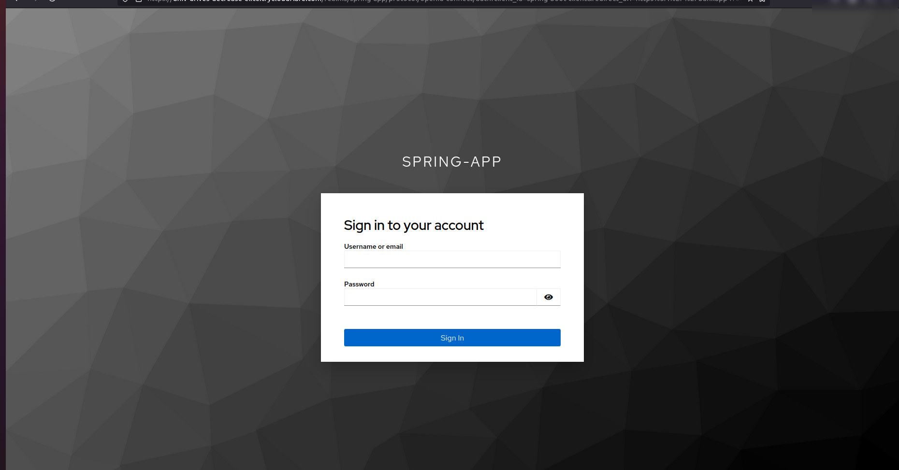

---

## 🏦 Dashboard

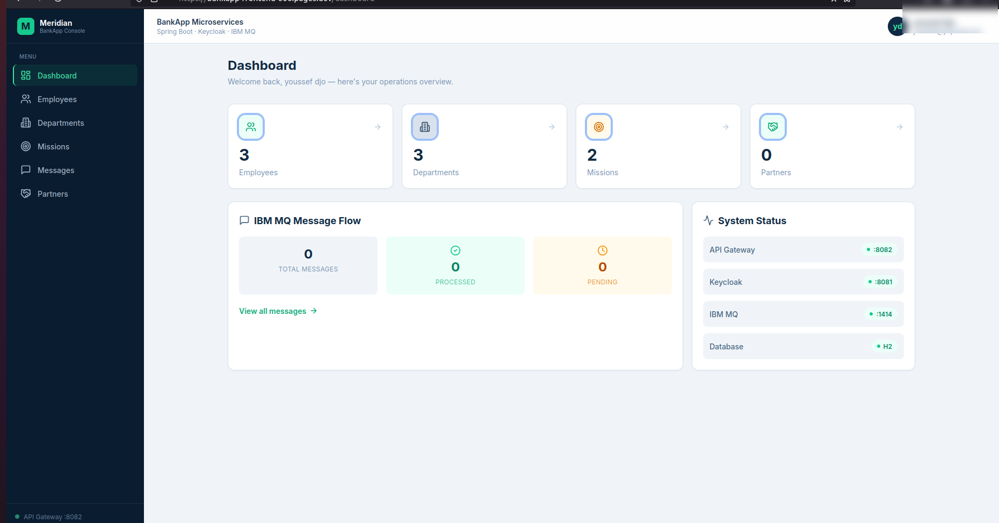

---

## 👥 Employees

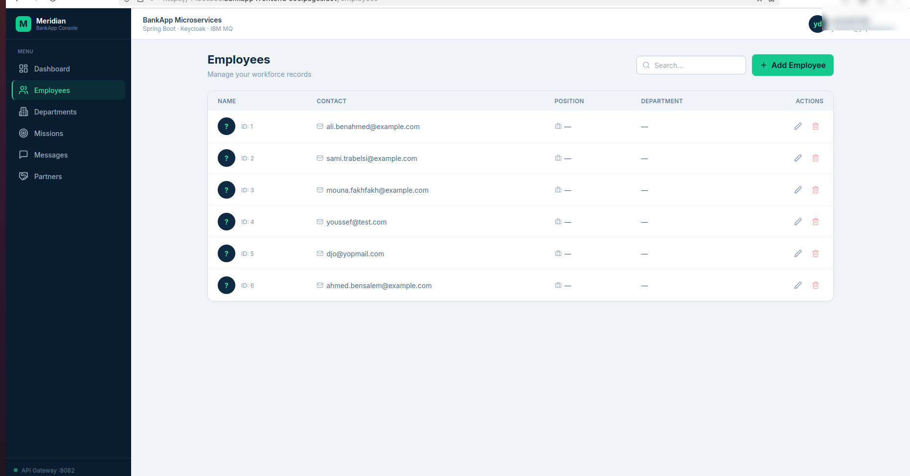

---

## ➕ Add Employee

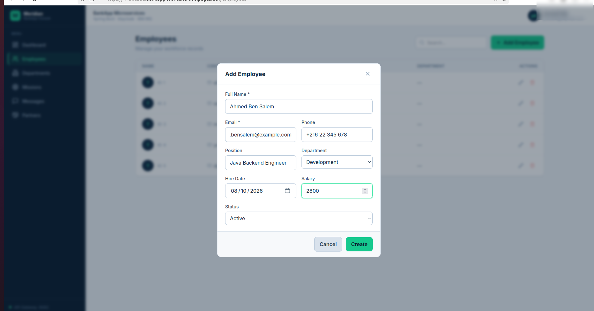

---

## 🏢 Departments

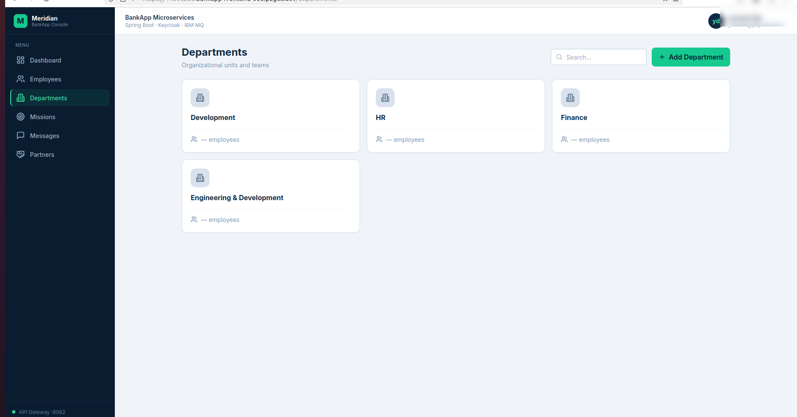

---

## ➕ Add Department

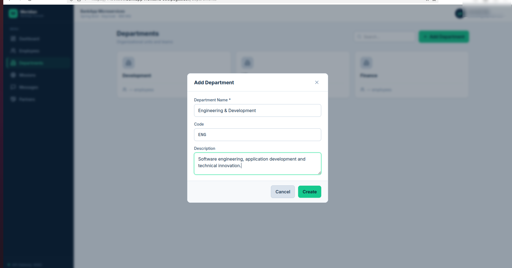

---

## 📨 Messages

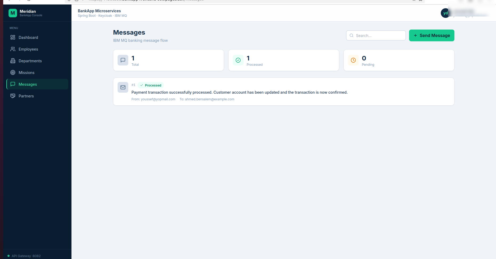

---

## 📨 Send Banking Message

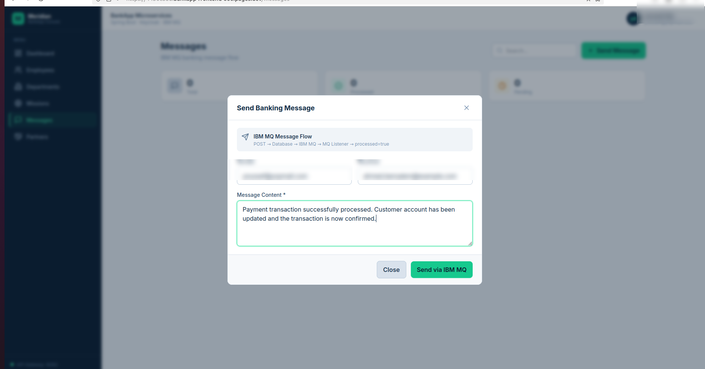

---

## 🤝 Partners

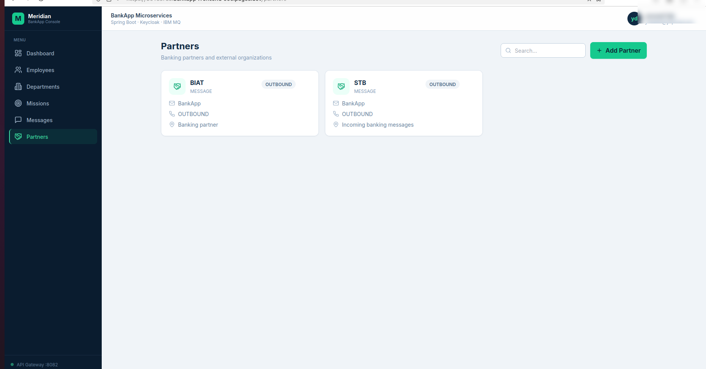

---

## ➕ Add Partner

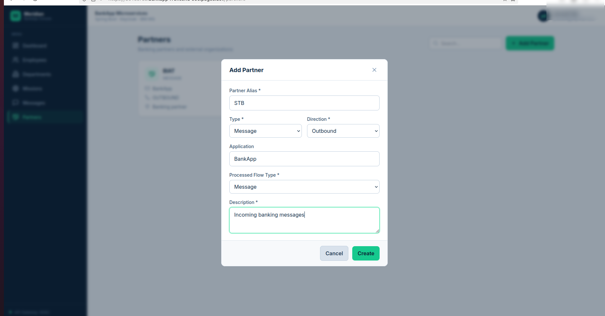

---

## 📭 Partners Empty State

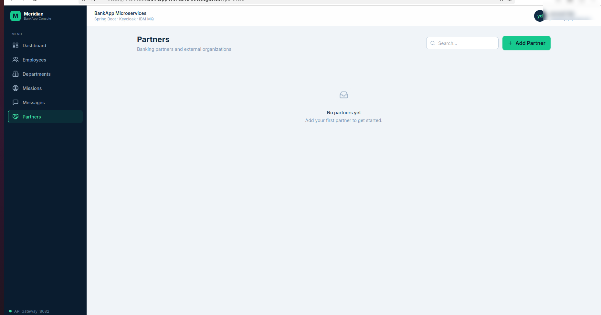

---

## 🎯 Missions

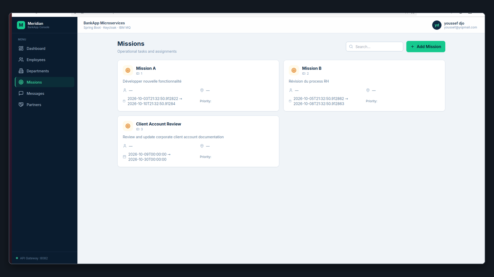

---

## ➕ Add Mission

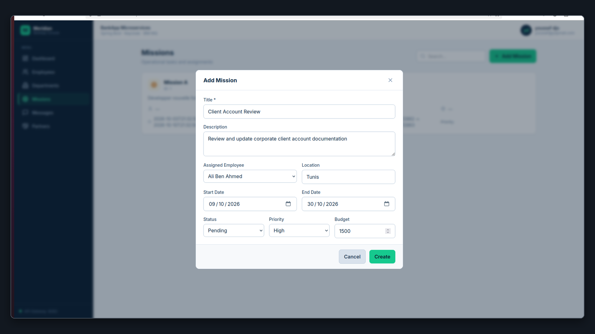

---

# 🧪 Testing & Validation

The project has been validated across several technical areas.

## Security

```text
JWT authentication              ✅
Keycloak integration            ✅
ADMIN authorization             ✅
USER authorization              ✅
Protected REST APIs             ✅
Gateway authentication          ✅
Personal message authorization  ✅
```

Expected HTTP behavior includes:

```text
Missing / invalid authentication
            │
            ▼
       401 Unauthorized
```

and insufficient permissions:

```text
Authenticated USER
        │
        ▼
ADMIN-only endpoint
        │
        ▼
   403 Forbidden
```

---

# 🧪 Maven Tests

Run the tests with:

```bash
mvn test
```

or, if Maven Wrapper is available:

```bash
./mvnw test
```

---

# 🔨 Backend Build

To build the backend without executing tests:

```bash
mvn clean package -DskipTests
```

---

# 📁 Repository Structure

The repository root is organized as follows:

```text
bankapp-microservice/
│
├── auth-service/
│
├── bankapp-domain/
│
├── bankapp-platform/
│
├── career-service/
│
├── common/
│
├── config-server/
│
├── discovery-server/
│
├── gateway-service/
│
├── hr-service/
│
├── message-router/
│
├── mission-service/
│
├── partner-service/
│
├── docs/
│   └── screenshots/
│       ├── 01-keycloak-login.png
│       ├── 02-dashboard.png
│       ├── 03-employees.png
│       ├── 04-add-employee.png
│       ├── 05-departments.png
│       ├── 06-add-department.png
│       ├── 07-messages.png
│       ├── 08-send-banking-message.png
│       ├── 09-partners.png
│       ├── 10-add-partner.png
│       ├── 11-partners-empty-state.png
│       ├── 12-missions.png
│       └── 13-add-mission.png
│
├── docker-compose.yml
├── pom.xml
├── .env.example
├── .gitignore
└── README.md
```

---

# 🧱 Architecture Modules

The repository contains several supporting modules in addition to the business microservices.

### `auth-service`

Authentication-related backend component and integration.

### `bankapp-domain`

Shared domain components used by the application architecture.

### `bankapp-platform`

Shared platform-level components and infrastructure.

### `career-service`

Dedicated application service module related to career/business functionality.

### `common`

Shared/common application components.

### `config-server`

Centralized configuration infrastructure.

### `discovery-server`

Eureka service discovery server.

### `gateway-service`

Central API Gateway.

### `hr-service`

Employee and department management.

### `message-router`

Banking messaging and IBM MQ integration.

### `mission-service`

Mission management and employee assignment.

### `partner-service`

Independent partner management microservice.

---

# 🛡️ Security Architecture

The application uses multiple layers of protection:

```text
                   ┌──────────────┐
                   │   Keycloak   │
                   └──────┬───────┘
                          │
                         JWT
                          │
                          ▼
                   ┌──────────────┐
                   │ API Gateway  │
                   └──────┬───────┘
                          │
                          ▼
                ┌─────────────────────┐
                │ Spring Security     │
                │ Resource Server     │
                └──────────┬──────────┘
                           │
                           ▼
                 Method Authorization
                           │
                           ▼
                    Business API
```

The architecture combines:

* centralized identity;
* token-based authentication;
* JWT validation;
* gateway security;
* microservice-level security;
* role-based authorization;
* method-level authorization.

---

# 🌍 CORS Architecture

CORS is handled centrally at the **API Gateway** level for frontend-to-backend communication.

The frontend communicates with:

```text
React
  │
  ▼
Gateway :8082
```

rather than contacting every microservice directly.

This avoids duplicate CORS headers and keeps cross-origin configuration centralized.

The Partner Service, for example, does not need its own frontend CORS configuration because browser requests are intended to enter through the Gateway.

---

# 🧠 Architectural Principles

The project follows several important microservice principles.

## Service Independence

Each business capability has its own service.

```text
HR
Mission
Message
Partner
```

## Database Ownership

Each business service owns its own PostgreSQL schema.

```text
HR       → hr_schema
Mission  → mission_schema
Message  → message_schema
Partner  → partner_schema
```

## Centralized API Entry Point

The frontend communicates through the Gateway.

```text
Frontend
    │
    ▼
Gateway
    │
    ▼
Microservices
```

## Dynamic Discovery

Service locations are discovered through Eureka rather than hard-coded IP addresses.

## Defense in Depth

Frontend visibility is combined with backend authorization.

## Controlled Database Evolution

Liquibase manages database changes while Hibernate validates the schema.

## Synchronous + Asynchronous Communication

The project combines:

```text
REST
 +
IBM MQ
```

---

# 📊 Technology Stack

| Layer                   | Technology                  |
| ----------------------- | --------------------------- |
| Language                | Java 17                     |
| Backend Framework       | Spring Boot 2.7.17          |
| Cloud Framework         | Spring Cloud 2021.0.8       |
| API Gateway             | Spring Cloud Gateway        |
| Service Discovery       | Netflix Eureka              |
| Authentication          | Keycloak                    |
| Security                | Spring Security             |
| Protocol                | OAuth2 / JWT                |
| ORM                     | Spring Data JPA / Hibernate |
| Database                | PostgreSQL                  |
| Database Migration      | Liquibase                   |
| Messaging               | IBM MQ                      |
| Build                   | Maven                       |
| Containers              | Docker                      |
| Orchestration           | Docker Compose              |
| API Documentation       | Swagger / OpenAPI           |
| Frontend                | React                       |
| Frontend Language       | TypeScript                  |
| Frontend Build          | Vite                        |
| UI                      | Tailwind CSS                |
| Frontend Authentication | Keycloak                    |
| Frontend Deployment     | Cloudflare Pages            |

---

# ☁️ Deployment

The frontend is deployed through **Cloudflare Pages**.

```text
React + TypeScript
        │
        ▼
Cloudflare Pages
        │
        ▼
API Gateway
        │
        ▼
Spring Boot Microservices
```

### Live Frontend

https://cddd48c5.bankapp-frontend-606.pages.dev

The live environment depends on the availability and configuration of the backend API and Keycloak authentication infrastructure.

---

# 🎯 Project Objectives

The main objective of **BankApp Microservices** is to demonstrate the design and implementation of an enterprise-oriented distributed application using technologies commonly used in professional Java backend environments.

The project focuses on:

* Microservices architecture
* Spring Boot
* Spring Cloud
* API Gateway
* Eureka service discovery
* OAuth2 / JWT
* Keycloak
* Spring Security
* Role-Based Access Control
* REST APIs
* PostgreSQL
* Liquibase
* IBM MQ
* Docker
* React
* TypeScript
* Frontend/backend integration
* API documentation
* Automated testing

---

# 🏆 Key Engineering Achievements

## Backend

* Designed a distributed Spring Boot microservices architecture
* Implemented API Gateway routing
* Implemented Eureka service discovery
* Integrated Keycloak
* Implemented OAuth2/JWT authentication
* Implemented role-based authorization
* Implemented method-level security
* Integrated IBM MQ
* Implemented synchronous REST communication
* Implemented asynchronous messaging
* Migrated business persistence to PostgreSQL
* Implemented Liquibase migrations
* Introduced dedicated PostgreSQL schemas
* Configured Hibernate schema validation
* Containerized backend services with Docker
* Added Swagger/OpenAPI documentation
* Added automated tests

## Partner Architecture

* Extracted partner management into a dedicated `partner-service`
* Added independent Partner persistence
* Added dedicated `partner_schema`
* Added Partner Liquibase migrations
* Registered Partner Service with Eureka
* Added Gateway routing through `PARTNER-SERVICE`
* Secured Partner APIs with Keycloak/JWT
* Implemented ADMIN/USER authorization
* Integrated Partner Service with the React frontend through the Gateway
* Centralized CORS at the Gateway level

## Frontend

* Built a React + TypeScript banking management interface
* Integrated Keycloak authentication
* Integrated JWT-based API authentication
* Implemented ADMIN/USER role-based UI
* Added employee management
* Added department management
* Added mission management
* Added partner management
* Added banking messaging
* Added personal USER message inbox
* Integrated frontend APIs through the Gateway
* Deployed frontend using Cloudflare Pages

---

# 💼 What This Project Demonstrates

From a software engineering perspective, the project demonstrates practical implementation of:

```text
Java 17
   │
   ├── Spring Boot
   ├── Spring Security
   ├── Spring Cloud
   │      ├── Gateway
   │      └── Eureka
   │
   ├── OAuth2 / JWT
   ├── Keycloak
   ├── REST APIs
   ├── PostgreSQL
   ├── Liquibase
   ├── IBM MQ
   ├── Docker
   ├── Maven
   └── Swagger / OpenAPI
```

The frontend complements the architecture with:

```text
React
   │
   ├── TypeScript
   ├── Vite
   ├── Tailwind CSS
   ├── Keycloak
   ├── JWT
   ├── REST API Integration
   └── Cloudflare Pages
```

---

# 🔗 Project Links

### Backend

https://github.com/youssefJmaiel/bankapp-microservice

### Frontend

https://github.com/youssefJmaiel/bankapp-frontend

### Live Application

https://cddd48c5.bankapp-frontend-606.pages.dev

### GitHub Profile

https://github.com/youssefJmaiel

### LinkedIn

https://linkedin.com/in/youssef-jmaiel

---

# 👨‍💻 Author

## Youssef Jmaiel

**Computer Science Engineer**

Focus:

**Java Backend · Spring Boot · Microservices · Full-Stack Development**

---

# 📜 License

This project is licensed under the **MIT License**.

---

# ⭐ Final Note

**BankApp Microservices** demonstrates a complete enterprise-oriented application architecture combining:

```text
                   ┌─────────────────────┐
                   │   React Frontend    │
                   │    TypeScript       │
                   └──────────┬──────────┘
                              │
                              ▼
                   ┌─────────────────────┐
                   │   Spring Gateway    │
                   │       :8082         │
                   └──────────┬──────────┘
                              │
                     ┌────────┴────────┐
                     │     Eureka      │
                     │      :8761      │
                     └────────┬────────┘
                              │
          ┌───────────┬───────┼────────┬───────────┐
          ▼           ▼       ▼        ▼           │
       HR :8083   Mission   Message   Partner      │
                  :8084     :8085     :8087        │
                     │         │        │           │
                     ▼         ▼        ▼           │
                 PostgreSQL PostgreSQL PostgreSQL   │
                               │                    │
                               ▼                    │
                            IBM MQ                  │
                              :1414                 │
                                                   │
                         Keycloak :8081 ◀──────────┘
```

This architecture demonstrates secure, discoverable, containerized and independently organized backend services integrated with a modern web frontend.
