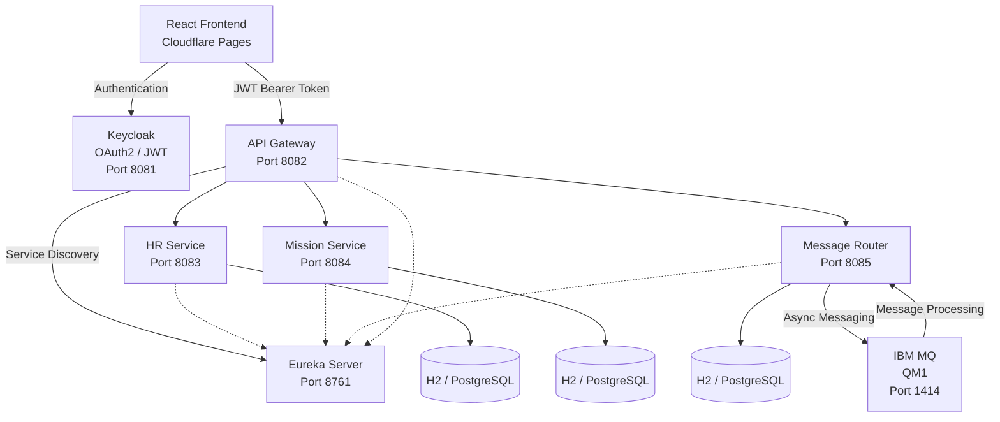

# 🏦 BankApp Microservices


> **Enterprise-oriented banking platform built with Java, Spring Boot, Spring Cloud, OAuth2/JWT, Keycloak, IBM MQ and Docker — with a React frontend deployed on Cloudflare Pages.**

[🌐 **Live Demo (Frontend)**](https://YOUR-FRONTEND-URL.pages.dev) · [💻 **GitHub**](https://github.com/youssefJmaiel/bankapp-microservice)

> ℹ️ The demo requires a Keycloak login. Demo credentials are available on request.

BankApp Microservices is a modular banking management platform designed around a **distributed microservices architecture**. Independent Spring Boot services are secured, discovered, routed and integrated through both **REST APIs and asynchronous IBM MQ messaging**.

---

## 📸 Screenshots

### 🔐 Authentication (Keycloak)


### 🏦 Banking Dashboard


### 👥 Employee Management

| Employees list | Add employee |
| --- | --- |
|  |  |

### 🏢 Departments

| Departments | Add department |
| --- | --- |
|  |  |

### 📨 Messaging (IBM MQ)

| Messages flow | Send banking message |
| --- | --- |
|  |  |

### 🤝 Partners

| Partners | Add partner |
| --- | --- |
|  |  |

---

## 🏗️ Architecture



### 🔄 End-to-End Flow

```text
React → Keycloak → JWT → API Gateway → Eureka → Services → IBM MQ
```

1. The user signs in through **Keycloak** and receives a **JWT access token**.
2. The React frontend calls the **API Gateway** with `Authorization: Bearer <token>`.
3. The Gateway validates the JWT and resolves the target service through **Eureka**.
4. The request is routed to **HR**, **Mission** or **Message Router**.
5. For banking messages: `POST → Database → IBM MQ → MQ Listener → processed=true`.

---

## 🚀 Project Highlights

* 🧩 **Microservices architecture** with independent Spring Boot services
* 🔐 **OAuth2 / JWT security** with Keycloak
* 👥 **Role-based authorization** with `ADMIN`, `AUDITOR` and `USER`
* 🌐 **Centralized API Gateway** using Spring Cloud Gateway
* 🔎 **Service discovery** using Netflix Eureka
* 📨 **IBM MQ integration** for asynchronous message processing
* 🐳 **Docker & Docker Compose** deployment
* 🗄️ **H2 for development, PostgreSQL-ready for production**
* 📚 **Swagger / OpenAPI** API documentation
* 🧪 **Unit testing** for business services
* ⚙️ Environment-based configuration using Docker environment variables

---

## 🧾 Stack at a Glance

| Layer | Technology | Version |
| --- | --- | --- |
| Language | Java | 17 |
| Framework | Spring Boot | 2.7.17 |
| Gateway / Discovery | Spring Cloud Gateway, Netflix Eureka | — |
| Security | Keycloak, OAuth2 Resource Server, JWT | — |
| Messaging | IBM MQ (QM1) | — |
| Database | H2 (dev) · PostgreSQL-ready (prod) | — |
| Build | Maven | 3.8+ |
| Containers | Docker, Docker Compose | — |
| Frontend | React (Cloudflare Pages) | — |
| API docs | Swagger / OpenAPI | — |

---

## 📦 Microservices

| Service | Port | Responsibility |
| --- | ---: | --- |
| **API Gateway** | `8082` | Central entry point, routing and security |
| **Auth Service** | — | Authentication-related backend integration |
| **HR Service** | `8083` | Employees and departments management |
| **Mission Service** | `8084` | Banking mission management |
| **Message Router** | `8085` | Message routing, partners and IBM MQ integration |
| **Eureka Server** | `8761` | Service discovery and registration |
| **IBM MQ** | `1414` | Asynchronous enterprise messaging |
| **Keycloak** | `8081` | Identity management and JWT tokens |

---

## 🌐 API Gateway

The Gateway provides a **single entry point** to the backend.

```text
/api/employees/**  → HR-SERVICE
/api/missions/**   → MISSION-SERVICE
/api/messages/**   → MESSAGE-ROUTER
/api/partners/**   → MESSAGE-ROUTER
```

Routing uses Eureka and Spring Cloud LoadBalancer:

```text
lb://HR-SERVICE
lb://MISSION-SERVICE
lb://MESSAGE-ROUTER
```

---

## 🔐 Security

Security is implemented with **Keycloak + OAuth2 + JWT**.

```text
Realm:  spring-app
Client: spring-boot-client
Roles:  ADMIN · AUDITOR · USER
```

```http
Authorization: Bearer <JWT_TOKEN>
```

The Gateway acts as the first security layer, while downstream services also have their own Spring Security configuration.

### ✅ Security Validation

The following scenarios were tested (no tokens or secrets are published in this repository):

| Scenario | Expected result |
| --- | --- |
| Request with a valid JWT | `200 OK` |
| Request without a JWT | `401 Unauthorized` |
| Role-based access (`ADMIN` / `AUDITOR` / `USER`) | Access granted or denied per role |
| JWT validation | Performed at the Gateway **and** in the downstream services |

---

## 📨 IBM MQ — Enterprise Messaging

The Message Router service communicates with IBM MQ for asynchronous message processing.

```text
REST Client → API Gateway → Message Router → IBM MQ
                                               ├── DEV.QUEUE.1
                                               └── DEV.QUEUE.2
```

The Message Router contains dedicated components for:

* MQ connection configuration
* Message production and consumption
* Queue listeners
* JSON serialization/deserialization
* Message routing
* Exception handling

This combines **synchronous REST communication** with **asynchronous enterprise messaging**.

---

## 🔎 Service Discovery

```text
                 Eureka
                 :8761
                   │
         ┌─────────┼─────────┐
         ▼         ▼         ▼
     HR Service  Mission   Message
                 Service   Router
```

Services register themselves with Eureka and the Gateway discovers them dynamically — no hard-coded IP addresses.

---

## 🗄️ Data Persistence

| Environment | Database |
| --- | --- |
| Development | H2 |
| Production | PostgreSQL-ready (driver and configuration prepared) |

The Message Router persists its domain data (messages, partners).

---

## 🐳 Docker

Each main microservice has its own Dockerfile:

```text
auth-service/Dockerfile
discovery-server/Dockerfile
gateway-service/Dockerfile
hr-service/Dockerfile
message-router/Dockerfile
mission-service/Dockerfile
```

Everything is orchestrated by `docker-compose.yml`.

### Environment Variables

```text
KEYCLOAK_CLIENT_SECRET
MQ_USER_IBM
MQ_PASSWORD_IBM
MQ_APP_PASSWORD
```

Sensitive values stay outside the repository: `.env` is excluded via `.gitignore`.

---

## ⚙️ Running the Project

### Prerequisites

* Java 17
* Maven 3.8+
* Git
* Docker & Docker Compose

### 1. Clone

```bash
git clone https://github.com/youssefJmaiel/bankapp-microservice.git
cd bankapp-microservice
```

### 2. Configure environment variables

```bash
cp .env.example .env
```

```env
KEYCLOAK_CLIENT_SECRET=your_keycloak_client_secret
MQ_USER_IBM=your_mq_user
MQ_PASSWORD_IBM=your_mq_password
MQ_APP_PASSWORD=your_mq_app_password
```

> **Important:** never commit your real `.env` file.

### 3. Configure Keycloak

Create the realm `spring-app`, the client `spring-boot-client`, and the roles `ADMIN`, `AUDITOR`, `USER`.

### 4. Start the Docker environment

```bash
docker compose up --build
```

(or `docker-compose up --build` on legacy installations)

### 5. Verify the stack

Check that all containers are up:

```bash
docker compose ps
```

Check service registration in Eureka:

```text
http://localhost:8761
```

Expected registered services:

```text
GATEWAY-SERVICE
HR-SERVICE
MISSION-SERVICE
MESSAGE-ROUTER
```

Optional quick check of the Gateway security (expects `401` without a token):

```bash
curl -i http://localhost:8082/api/employees
```

### 6. Access the backend

| Component | URL |
| --- | --- |
| API Gateway | `http://localhost:8082` |
| HR Service | `http://localhost:8083/api/employees` |
| Mission Service | `http://localhost:8084/api/missions` |
| Message Router | `http://localhost:8085/api/messages` |
| Partners | `http://localhost:8085/api/partners` |
| Eureka | `http://localhost:8761` |
| Swagger UI (example) | `http://localhost:8083/swagger-ui/index.html` |

---

## 🧪 Testing

```bash
mvn test
```

Unit tests cover the business logic, e.g. `message-router/src/test/` (message service layer).

---

## 📁 Project Structure

```text
bankapp-microservice/
├── auth-service/
├── bankapp-platform/
├── career-service/
├── common/
├── config-server/
├── discovery-server/
├── gateway-service/
├── hr-service/
├── message-router/
├── mission-service/
├── partner-service/
├── docs/
│   └── screenshots/
├── docker-compose.yml
├── .env.example
├── .gitignore
└── README.md
```

---

## 🎯 Project Goals

* Separation of business responsibilities
* Secure API communication
* Independent service deployment
* Dynamic service discovery
* Centralized API routing
* Asynchronous messaging
* Containerized infrastructure
* Development-to-production database flexibility

---

## 👨‍💻 Author

**Youssef Jmaiel** — Computer Science Engineer focused on **Java Backend, Spring Boot and Microservices**.

* GitHub: https://github.com/youssefJmaiel
* Project: https://github.com/youssefJmaiel/bankapp-microservice

---

## 📜 License

This project is licensed under the MIT License.
