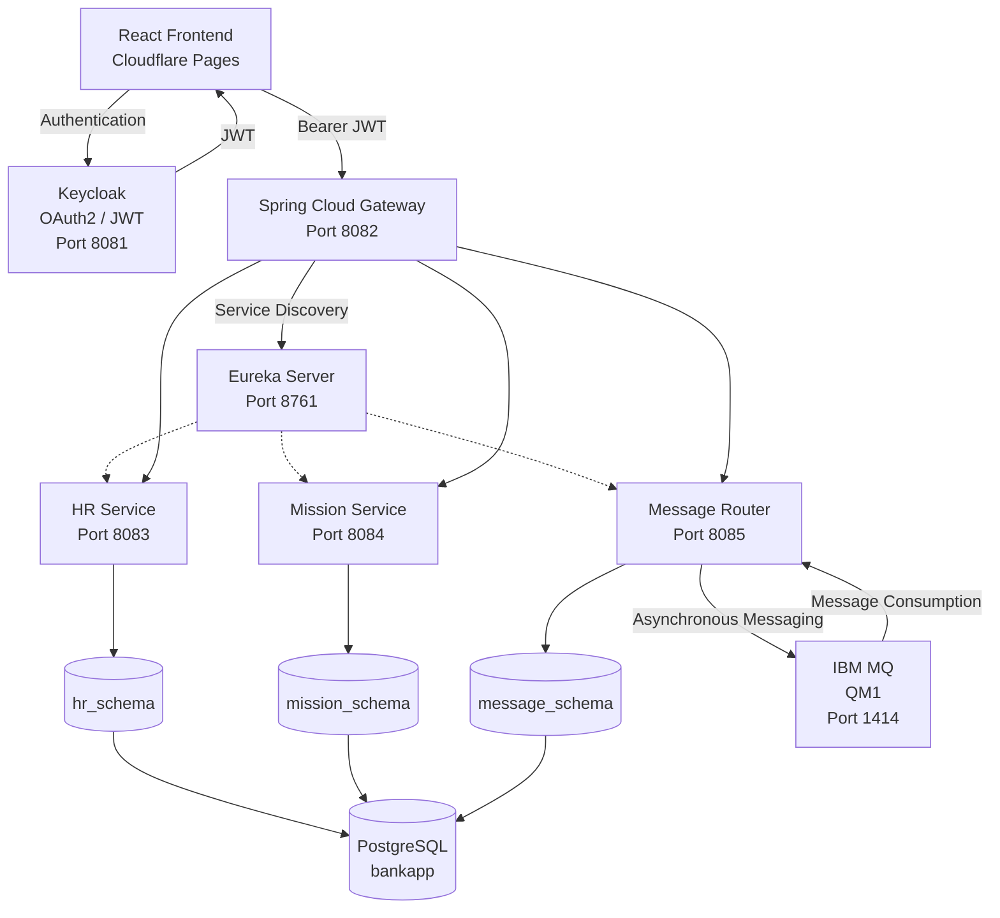

# 🏦 BankApp Microservices


> **Enterprise-oriented banking management platform built with Java, Spring Boot, Spring Cloud, OAuth2/JWT, Keycloak, IBM MQ, PostgreSQL, Liquibase, Docker, React and TypeScript.**

🌐 **Live Demo:**
https://cddd48c5.bankapp-frontend-606.pages.dev

💻 **Backend Repository:**
https://github.com/youssefJmaiel/bankapp-microservice

💻 **Frontend Repository:**
https://github.com/youssefJmaiel/bankapp-frontend

---

# 📌 Overview

**BankApp Microservices** is a full-stack enterprise-oriented banking management platform based on a distributed **microservices architecture**.

The backend is implemented with **Java 17 and Spring Boot**, using Spring Cloud components for API Gateway and service discovery. Authentication and authorization are handled through **Keycloak, OAuth2 and JWT**.

The application combines:

* Microservices architecture
* Spring Cloud Gateway
* Netflix Eureka service discovery
* Keycloak authentication
* OAuth2 / JWT security
* Role-Based Access Control (RBAC)
* PostgreSQL persistence
* Liquibase database migrations
* IBM MQ asynchronous messaging
* Docker and Docker Compose
* REST APIs
* Swagger / OpenAPI
* React + TypeScript frontend
* Cloudflare Pages deployment

The project demonstrates both **synchronous REST communication** and **asynchronous enterprise messaging** through IBM MQ.

---

# ✨ Main Features

## 🔐 Authentication & Security

The application uses **Keycloak** as the centralized identity and access management system.

Main security features:

* Keycloak authentication
* OAuth2 / JWT access tokens
* Spring Security Resource Server
* JWT validation
* Role-Based Access Control
* Protected REST APIs
* Gateway-based API access
* Backend authorization
* Frontend role-based visibility

Authenticated requests use:

```http
Authorization: Bearer <JWT_TOKEN>
```

The backend validates the JWT before allowing access to protected resources.

---

# 👑 Role-Based Access Control

The application currently focuses on two main application roles:

```text
ADMIN
USER
```

The backend remains the final authority for authorization.

Frontend role-based visibility is used to improve the user experience, while Spring Security protects the actual backend endpoints.

---

## 👑 ADMIN

The administrator has full access to the management platform.

### Employees

* View employees
* Add employees
* Edit employees
* Delete employees

### Departments

* View departments
* Add departments
* Edit departments
* Delete departments

### Missions

* View missions
* Add missions
* Edit missions
* Delete missions
* Assign missions to employees

### Partners

* View partners
* Add partners
* Delete partners

### Messages

* View all banking messages
* Send banking messages
* Delete messages
* Access IBM MQ messaging functionality

---

## 👤 USER

The standard user has consultation access to the business modules.

The USER can:

* View employees
* View departments
* View missions
* View partners
* View assigned employee information
* Access the personal messaging inbox
* Read messages addressed to their username

The USER cannot:

* Add employees
* Edit employees
* Delete employees
* Add departments
* Edit departments
* Delete departments
* Create missions
* Modify missions
* Delete missions
* Add partners
* Delete partners
* Send banking messages
* Delete messages
* Access administrative message-management functionality

---

# 📬 Personal Message Inbox

Authenticated users have access to a dedicated personal inbox endpoint:

```http
GET /api/messages/my
```

The backend extracts the authenticated user's:

```text
preferred_username
```

from the JWT.

Only messages where:

```text
receiver = authenticated username
```

are returned.

This prevents standard users from accessing the complete administrative message collection.

Example:

```text
JWT
 │
 └── preferred_username = john
          │
          ▼
GET /api/messages/my
          │
          ▼
Messages where receiver = "john"
```

---

# 🏗️ Architecture



---

# 🔄 End-to-End Request Flow

```text
React Frontend
      │
      ▼
  Keycloak
      │
      │ JWT
      ▼
Spring Cloud Gateway
      │
      ▼
    Eureka
      │
      ├───────────────┬────────────────┐
      ▼               ▼                ▼
 HR Service      Mission Service   Message Router
      │               │                │
      ▼               ▼                ▼
 PostgreSQL       PostgreSQL       PostgreSQL
                                      │
                                      ▼
                                   IBM MQ
```

---

# 🔐 Authentication Flow

```text
User
  │
  ▼
Keycloak
  │
  │ OAuth2 / JWT
  ▼
React Frontend
  │
  │ Authorization: Bearer <JWT>
  ▼
Spring Cloud Gateway
  │
  ▼
Downstream Microservice
  │
  ▼
Spring Security
  │
  ▼
Authorized Resource
```

Keycloak provides centralized authentication and issues JWT access tokens.

Each protected backend service validates the JWT and applies role-based authorization rules.

---

# 📸 Application Screenshots

The following screenshots demonstrate the main authentication, management and messaging features of the application.

---

## 🔐 1. Keycloak Authentication


The application uses **Keycloak** for centralized authentication and identity management.

---

# 🏦 Banking Dashboard

## 2. Dashboard


The main dashboard provides access to the different business modules according to the authenticated user's role.

---

# 👥 Employee Management

## 3. Employees


The employee management interface provides access to employee information.

ADMIN users can perform management operations, while USER users have consultation access.

## 4. Add Employee


Employee creation is restricted to ADMIN users.

---

# 🏢 Department Management

## 5. Departments


Departments are managed through the HR microservice.

## 6. Add Department


Creating departments is an administrative operation available to ADMIN users.

---

# 📨 Banking Messages

## 7. Messages


The messaging interface provides access to banking messages.

### ADMIN

ADMIN users can:

* View all messages
* Send messages
* Delete messages
* Access the IBM MQ messaging workflow

### USER

USER users have a personal inbox and can retrieve only messages addressed to their account.

The frontend calls:

```http
GET /api/messages/my
```

instead of the administrative:

```http
GET /api/messages
```

This provides separation between administrative and personal messaging access.

---

## 8. Send Banking Message


Sending banking messages is restricted to ADMIN users.

The message is persisted by the Message Router and routed toward IBM MQ for asynchronous processing.

---

# 🤝 Partner Management

## 9. Partners


The Partner Management functionality is provided by the Message Router service.

## 10. Add Partner


Partner creation is restricted to ADMIN users.

## 11. Partners Empty State


The application provides a clean empty-state interface when no partners are available.

---

# 🎯 Mission Management

## 12. Mission Consultation


The Mission Management interface allows authenticated users to consult available missions.

Users can access information about the employee associated with a mission according to the backend authorization rules.

## 13. Add Mission


ADMIN users can create and assign missions to employees.

The frontend sends mission information through the API Gateway to the Mission Service.

---

# 📨 IBM MQ — Asynchronous Messaging

The **Message Router** integrates IBM MQ to demonstrate enterprise asynchronous messaging.

```text
React Frontend
      │
      ▼
API Gateway
      │
      ▼
Message Router
      │
      ├── PostgreSQL
      │
      ▼
   IBM MQ
      │
      ├── DEV.QUEUE.1
      └── DEV.QUEUE.2
```

The Message Router contains components responsible for:

* IBM MQ connection configuration
* Message production
* Message consumption
* Queue listeners
* JSON serialization/deserialization
* Message routing
* Exception handling
* Message persistence

The project demonstrates the combination of:

```text
Synchronous REST APIs
          +
Asynchronous IBM MQ Messaging
```

---

# 📬 Message Processing Flow

## ADMIN Message Flow

```text
ADMIN
  │
  │ Send Banking Message
  ▼
React Frontend
  │
  ▼
API Gateway
  │
  ▼
Message Router
  │
  ├── Persist Message
  │
  ▼
IBM MQ
  │
  ▼
MQ Listener
  │
  ▼
Message Processing
```

## USER Personal Inbox Flow

```text
USER
 │
 ▼
React Frontend
 │
 ▼
API Gateway
 │
 ▼
Message Router
 │
 ▼
/api/messages/my
 │
 ▼
JWT preferred_username
 │
 ▼
Messages addressed to USER
```

---

# 🔎 Service Discovery — Eureka

Netflix Eureka provides dynamic service registration and discovery.

```text
                    Eureka
                     :8761
                       │
          ┌────────────┼────────────┐
          ▼            ▼            ▼
      HR Service    Mission     Message Router
        :8083        :8084          :8085
```

The Gateway communicates with services using logical service identifiers:

```text
HR-SERVICE
MISSION-SERVICE
MESSAGE-ROUTER
```

This avoids hard-coded backend service addresses in the Gateway routing configuration.

---

# 🌐 API Gateway

Spring Cloud Gateway provides a centralized entry point for frontend requests.

### Gateway Routes

```text
/api/employees/**  → HR-SERVICE
/api/missions/**   → MISSION-SERVICE
/api/messages/**   → MESSAGE-ROUTER
/api/partners/**   → MESSAGE-ROUTER
```

The Gateway uses Eureka and Spring Cloud LoadBalancer:

```text
lb://HR-SERVICE
lb://MISSION-SERVICE
lb://MESSAGE-ROUTER
```

The frontend is therefore designed to communicate with the backend through the API Gateway rather than directly calling each microservice.

---

# 🔐 Security Architecture

Authentication and authorization are implemented using:

* Keycloak
* OAuth2
* JWT
* Spring Security
* OAuth2 Resource Server

### Application Roles

```text
ADMIN
USER
```

The Keycloak environment may also contain additional roles such as:

```text
AUDITOR
```

but the current frontend authorization model focuses on:

```text
ADMIN
USER
```

---

# 🛡️ Role-Based Authorization Matrix

| Feature               | ADMIN | USER |
| --------------------- | :---: | :--: |
| Dashboard             |   ✅   |   ✅  |
| View Employees        |   ✅   |   ✅  |
| Add Employee          |   ✅   |   ❌  |
| Edit Employee         |   ✅   |   ❌  |
| Delete Employee       |   ✅   |   ❌  |
| View Departments      |   ✅   |   ✅  |
| Add Department        |   ✅   |   ❌  |
| Edit Department       |   ✅   |   ❌  |
| Delete Department     |   ✅   |   ❌  |
| View Missions         |   ✅   |   ✅  |
| Add Mission           |   ✅   |   ❌  |
| Edit Mission          |   ✅   |   ❌  |
| Delete Mission        |   ✅   |   ❌  |
| View Partners         |   ✅   |   ✅  |
| Add Partner           |   ✅   |   ❌  |
| Delete Partner        |   ✅   |   ❌  |
| View All Messages     |   ✅   |   ❌  |
| View Personal Inbox   |   ✅   |   ✅  |
| Send Message          |   ✅   |   ❌  |
| Delete Message        |   ✅   |   ❌  |
| IBM MQ Administration |   ✅   |   ❌  |

> **Backend authorization remains the source of truth.** Frontend role-based visibility improves usability, while protected backend endpoints enforce actual permissions.

---

# 🗄️ Database Architecture

The application currently uses **PostgreSQL** as the primary relational database for the migrated microservices.

The database is organized using separate PostgreSQL schemas according to service ownership.

```text
PostgreSQL
│
└── bankapp
    │
    ├── hr_schema
    │   ├── departments
    │   ├── employees
    │   ├── databasechangelog
    │   └── databasechangeloglock
    │
    ├── mission_schema
    │   ├── missions
    │   ├── databasechangelog
    │   └── databasechangeloglock
    │
    └── message_schema
        ├── messages
        ├── partners
        ├── databasechangelog
        └── databasechangeloglock
```

### Service Ownership

| Service         | PostgreSQL Schema | Main Tables                |
| --------------- | ----------------- | -------------------------- |
| HR Service      | `hr_schema`       | `employees`, `departments` |
| Mission Service | `mission_schema`  | `missions`                 |
| Message Router  | `message_schema`  | `messages`, `partners`     |

This schema-based organization provides clear separation of domain data while using a shared PostgreSQL database instance.

---

# 🔄 Database Migrations — Liquibase

Database schema creation and evolution are managed using **Liquibase**.

Each migrated microservice maintains its own Liquibase changelog.

```text
HR Service
    │
    └── db/changelog
            ├── 001-create-departments.yaml
            └── 002-create-employees.yaml

Mission Service
    │
    └── db/changelog
            └── 001-create-missions.yaml

Message Router
    │
    └── db/changelog
            ├── 001-create-messages.yaml
            └── 002-create-partners.yaml
```

Hibernate is configured with:

```yaml
ddl-auto: validate
```

This means Hibernate validates the database structure instead of creating or modifying tables automatically.

Liquibase remains responsible for database schema creation and controlled schema evolution.

This approach provides:

* Version-controlled database changes
* Reproducible database initialization
* Controlled schema evolution
* Clear migration history
* Separation between ORM validation and database migration

---

# 🧾 Technology Stack

| Layer              | Technology                  | Details                |
| ------------------ | --------------------------- | ---------------------- |
| Backend Language   | Java                        | 17                     |
| Backend Framework  | Spring Boot                 | 2.7.17                 |
| Cloud              | Spring Cloud                | Gateway / Eureka       |
| Service Discovery  | Netflix Eureka              | Dynamic discovery      |
| API Gateway        | Spring Cloud Gateway        | Centralized routing    |
| Security           | Keycloak                    | OAuth2 / JWT           |
| Authentication     | OAuth2 Resource Server      | JWT validation         |
| Authorization      | Spring Security             | RBAC                   |
| Messaging          | IBM MQ                      | QM1                    |
| Database           | PostgreSQL                  | Relational persistence |
| Database Migration | Liquibase                   | Versioned migrations   |
| ORM                | Spring Data JPA / Hibernate | `ddl-auto: validate`   |
| Build              | Maven                       | 3.8+                   |
| Containers         | Docker / Docker Compose     | Backend infrastructure |
| Frontend           | React                       | SPA                    |
| Frontend Language  | TypeScript                  | Type-safe frontend     |
| Frontend Build     | Vite                        | Modern build tooling   |
| UI                 | Tailwind CSS                | Responsive interface   |
| API Documentation  | Swagger / OpenAPI           | REST documentation     |
| Deployment         | Cloudflare Pages            | Frontend deployment    |

---

# 📦 Microservices

| Service             |   Port | Responsibility                             |
| ------------------- | -----: | ------------------------------------------ |
| **API Gateway**     | `8082` | Central API entry point and routing        |
| **Auth Service**    |      — | Authentication-related backend integration |
| **HR Service**      | `8083` | Employees and departments                  |
| **Mission Service** | `8084` | Mission management                         |
| **Message Router**  | `8085` | Messages, partners and IBM MQ              |
| **Eureka Server**   | `8761` | Service discovery                          |
| **Keycloak**        | `8081` | Identity and access management             |
| **IBM MQ**          | `1414` | Asynchronous messaging                     |

---

# 🗂️ Service Responsibilities

## HR Service

Responsible for:

```text
Employees
Departments
```

PostgreSQL schema:

```text
hr_schema
```

---

## Mission Service

Responsible for:

```text
Missions
Employee assignments
```

PostgreSQL schema:

```text
mission_schema
```

Mission assignments use an employee identifier:

```text
assignedEmployeeId
```

The Mission Service does not maintain a direct database foreign key to the HR Service, preserving service boundaries.

---

## Message Router

Responsible for:

```text
Messages
Partners
IBM MQ integration
```

PostgreSQL schema:

```text
message_schema
```

The Message Router combines:

```text
REST APIs
   +
PostgreSQL
   +
IBM MQ
```

---

# 🐳 Docker & Docker Compose

The backend application infrastructure is containerized using Docker.

Main containerized services include:

```text
auth-service
discovery-server
gateway-service
hr-service
message-router
mission-service
ibm-mq
```

The environment can be started using:

```bash
docker compose up --build
```

PostgreSQL is currently provided by the host environment rather than by a PostgreSQL container.

The application containers connect to the host PostgreSQL instance through:

```text
host.docker.internal
```

This architecture keeps PostgreSQL separate from the Docker Compose application stack.

---

# ⚙️ Environment Configuration

Sensitive configuration is provided through environment variables.

Example:

```env
KEYCLOAK_CLIENT_SECRET=your_keycloak_client_secret

MQ_USER_IBM=your_mq_user
MQ_PASSWORD_IBM=your_mq_password
MQ_APP_PASSWORD=your_mq_app_password

POSTGRES_DB=bankapp
POSTGRES_USER=bankapp
POSTGRES_PASSWORD=your_postgres_password
```

The real `.env` file is excluded from Git.

Example `.gitignore` entries:

```gitignore
.env
target/
```

An example configuration is provided through:

```text
.env.example
```

> ⚠️ **Never commit real credentials, passwords, access tokens or client secrets to the repository.**

---

# 🌐 Frontend

The frontend is implemented using:

* React
* TypeScript
* Vite
* Tailwind CSS
* Keycloak
* OAuth2 / JWT
* REST API integration

The frontend communicates with the backend through the API Gateway.

```text
React
  │
  ▼
Keycloak Authentication
  │
  ▼
JWT
  │
  ▼
API Gateway
  │
  ▼
Microservices
```

The frontend implements role-based visibility for:

```text
ADMIN
USER
```

Administrative actions are hidden from standard users, while the backend independently enforces authorization.

---

# ☁️ Deployment

The frontend is deployed using **Cloudflare Pages**.

```text
React + TypeScript
        │
        ▼
   Cloudflare Pages
        │
        ▼
   API Gateway
        │
        ▼
  Spring Microservices
```

### Live Frontend

https://cddd48c5.bankapp-frontend-606.pages.dev

> The live frontend depends on the availability and configuration of the backend infrastructure and Keycloak authentication.

---

# 📚 API Documentation

REST APIs are documented using **Swagger / OpenAPI**.

Example:

```text
http://localhost:8083/swagger-ui/index.html
```

Additional service documentation is available through the corresponding microservice Swagger configuration.

The main API Gateway is available at:

```text
http://localhost:8082
```

---

# 🌐 Backend Endpoints

| Component         | URL                                           |
| ----------------- | --------------------------------------------- |
| API Gateway       | `http://localhost:8082`                       |
| HR Service        | `http://localhost:8083`                       |
| Employees API     | `http://localhost:8083/api/employees`         |
| Mission Service   | `http://localhost:8084`                       |
| Missions API      | `http://localhost:8084/api/missions`          |
| Message Router    | `http://localhost:8085`                       |
| Messages API      | `http://localhost:8085/api/messages`          |
| Personal Messages | `http://localhost:8085/api/messages/my`       |
| Partners API      | `http://localhost:8085/api/partners`          |
| Eureka            | `http://localhost:8761`                       |
| Keycloak          | `http://localhost:8081`                       |
| Swagger UI        | `http://localhost:8083/swagger-ui/index.html` |

For normal frontend communication, requests are intended to go through the **API Gateway**.

---

# 🧪 Testing & Validation

The project includes unit tests and has been validated through authentication, authorization, database, messaging and integration scenarios.

### Security Validation

| Scenario                       | Result             |
| ------------------------------ | ------------------ |
| Valid JWT                      | `200 OK`           |
| Missing JWT                    | `401 Unauthorized` |
| JWT authentication             | ✅ Validated        |
| ADMIN role                     | ✅ Supported        |
| USER role                      | ✅ Supported        |
| Gateway → HR with JWT          | ✅ Validated        |
| USER → Personal Messages       | `200 OK`           |
| USER → Administrative Messages | `403 Forbidden`    |
| USER → Send Message            | `403 Forbidden`    |
| ADMIN → Send Message           | ✅ Allowed          |

### Database Validation

The following migrations have been successfully validated:

```text
HR Service
    └── PostgreSQL + Liquibase
        └── hr_schema

Mission Service
    └── PostgreSQL + Liquibase
        └── mission_schema

Message Router
    └── PostgreSQL + Liquibase
        └── message_schema
```

### Message Router Validation

The Message Router has been validated with:

```text
PostgreSQL connection       ✅
Liquibase migrations        ✅
Hibernate validation        ✅
Eureka registration         ✅
JWT authentication          ✅
REST API                    ✅
IBM MQ connection           ✅
```

### Maven Tests

Run:

```bash
./mvnw test
```

or:

```bash
mvn test
```

### Maven Build

The complete backend can be built with:

```bash
mvn clean package -DskipTests
```

---

# 📁 Project Structure

```text
bankapp-microservice/
│
├── auth-service/
├── bankapp-platform/
├── career-service/
├── common/
├── config-server/
├── discovery-server/
├── gateway-service/
├── hr-service/
├── message-router/
├── mission-service/
├── partner-service/
│
├── docs/
│   └── screenshots/
│       ├── 01-keycloak-login.png
│       ├── 02-dashboard.png
│       ├── 03-employees.png
│       ├── 04-add-employee.png
│       ├── 05-departments.png
│       ├── 06-add-department.png
│       ├── 07-messages.png
│       ├── 08-send-banking-message.png
│       ├── 09-partners.png
│       ├── 10-add-partner.png
│       ├── 11-partners-empty-state.png
│       ├── 12-missions.png
│       └── 13-add-mission.png
│
├── docker-compose.yml
├── .env.example
├── .gitignore
└── README.md
```

---

# 🔄 Main Technical Concepts Demonstrated

## Microservices

Independent services with clearly separated business responsibilities.

## API Gateway

Centralized entry point for frontend-to-backend communication.

## Service Discovery

Dynamic service registration and discovery using Eureka.

## OAuth2 / JWT

Token-based authentication and authorization.

## Keycloak

Centralized identity and access management.

## Role-Based Authorization

Different application permissions based on authenticated roles.

```text
ADMIN
USER
```

## REST APIs

Synchronous communication between frontend, Gateway and backend services.

## Asynchronous Messaging

IBM MQ for enterprise asynchronous message processing.

## PostgreSQL

Relational persistence for the application's business domains.

## Liquibase

Version-controlled and reproducible database schema migrations.

## JPA / Hibernate

Object-relational mapping with database schema validation.

## Containerization

Docker and Docker Compose for application infrastructure.

## API Documentation

Swagger / OpenAPI for REST API documentation.

## Automated Testing

Unit and integration-oriented validation of application functionality.

---

# 🎯 Project Objectives

The main objective of **BankApp Microservices** is to demonstrate the design and implementation of an enterprise-oriented distributed application using technologies commonly found in professional Java backend environments.

The project focuses on:

* Microservices architecture
* Separation of business responsibilities
* Secure API communication
* Centralized authentication
* OAuth2 / JWT
* Role-based authorization
* API Gateway routing
* Dynamic service discovery
* REST APIs
* Asynchronous messaging
* IBM MQ integration
* PostgreSQL persistence
* Liquibase database migrations
* Docker containerization
* API documentation
* Unit testing
* Frontend/backend integration
* Cloud deployment

---

# 💼 What This Project Demonstrates

From a software engineering perspective, the project demonstrates practical implementation of:

```text
Java 17
   │
   ├── Spring Boot
   ├── Spring Security
   ├── Spring Cloud
   │      ├── Gateway
   │      └── Eureka
   │
   ├── OAuth2 / JWT
   ├── Keycloak
   ├── REST APIs
   ├── PostgreSQL
   ├── Liquibase
   ├── IBM MQ
   ├── Docker
   ├── Maven
   └── Swagger / OpenAPI
```

The frontend complements the backend architecture with:

```text
React
   │
   ├── TypeScript
   ├── Vite
   ├── Tailwind CSS
   ├── Keycloak Authentication
   ├── OAuth2 / JWT
   ├── REST API Integration
   └── Cloudflare Pages
```

---

# 🚀 Key Achievements

## Backend

* Designed a distributed Spring Boot microservices architecture
* Implemented Spring Cloud Gateway
* Implemented Eureka service discovery
* Integrated Keycloak
* Implemented OAuth2 / JWT security
* Implemented role-based authorization
* Integrated IBM MQ
* Implemented synchronous REST and asynchronous messaging
* Migrated HR Service to PostgreSQL
* Migrated Mission Service to PostgreSQL
* Migrated Message Router to PostgreSQL
* Implemented Liquibase database migrations
* Organized domain data using dedicated PostgreSQL schemas
* Configured Hibernate schema validation
* Containerized backend services with Docker
* Added Swagger / OpenAPI documentation
* Implemented unit testing

## Frontend

* Built a React + TypeScript banking management interface
* Integrated Keycloak authentication
* Implemented JWT-based authentication
* Implemented ADMIN / USER role-based UI
* Added employee management
* Added department management
* Added mission management
* Added partner management
* Added banking messaging
* Implemented personal USER message inbox
* Hid administrative operations from standard users
* Integrated frontend with the API Gateway
* Deployed frontend using Cloudflare Pages

## Database & Persistence

The project implements a structured persistence strategy:

```text
PostgreSQL
    │
    ├── hr_schema
    │      ├── employees
    │      └── departments
    │
    ├── mission_schema
    │      └── missions
    │
    └── message_schema
           ├── messages
           └── partners
```

Database changes are version-controlled through Liquibase.

Hibernate uses:

```text
ddl-auto = validate
```

providing schema validation without allowing the ORM to modify the database structure automatically.

## Security & Authorization

The application follows a **defense-in-depth authorization approach**:

```text
Frontend Role-Based UI
        +
Backend Spring Security
        +
Keycloak JWT
        =
Protected Enterprise Application
```

Frontend restrictions improve usability, while backend authorization prevents unauthorized API access.

---

# 🏆 Engineering Highlights

The project demonstrates several concepts relevant to professional Java backend development:

### Distributed Architecture

Business capabilities are separated into independent services.

### Centralized Routing

Spring Cloud Gateway provides a single API entry point.

### Dynamic Discovery

Eureka allows services to register and discover each other dynamically.

### Centralized Identity

Keycloak manages authentication and JWT issuance.

### Secure APIs

Spring Security validates JWTs and enforces authorization rules.

### Enterprise Messaging

IBM MQ provides asynchronous message processing.

### Database Versioning

Liquibase provides controlled and reproducible schema migrations.

### Domain Isolation

PostgreSQL schemas separate the data ownership of each service.

### Containerized Infrastructure

Docker Compose simplifies local deployment of the backend infrastructure.

### Full-Stack Integration

React and TypeScript provide the frontend while Spring Boot microservices provide the backend.

---

# 🌐 Live Application

The React frontend is available online:

**https://cddd48c5.bankapp-frontend-606.pages.dev**

Authentication is handled through Keycloak.

> The live environment may depend on the availability and configuration of the backend infrastructure and authentication services.

---

# 👨‍💻 Author

## Youssef Jmaiel

**Computer Science Engineer**

Focused on:

**Java Backend · Spring Boot · Microservices · Full-Stack Development**

### GitHub

https://github.com/youssefJmaiel

### LinkedIn

https://linkedin.com/in/youssef-jmaiel

### Backend Project

https://github.com/youssefJmaiel/bankapp-microservice

### Frontend Project

https://github.com/youssefJmaiel/bankapp-frontend

---

# 📜 License

This project is licensed under the **MIT License**.
