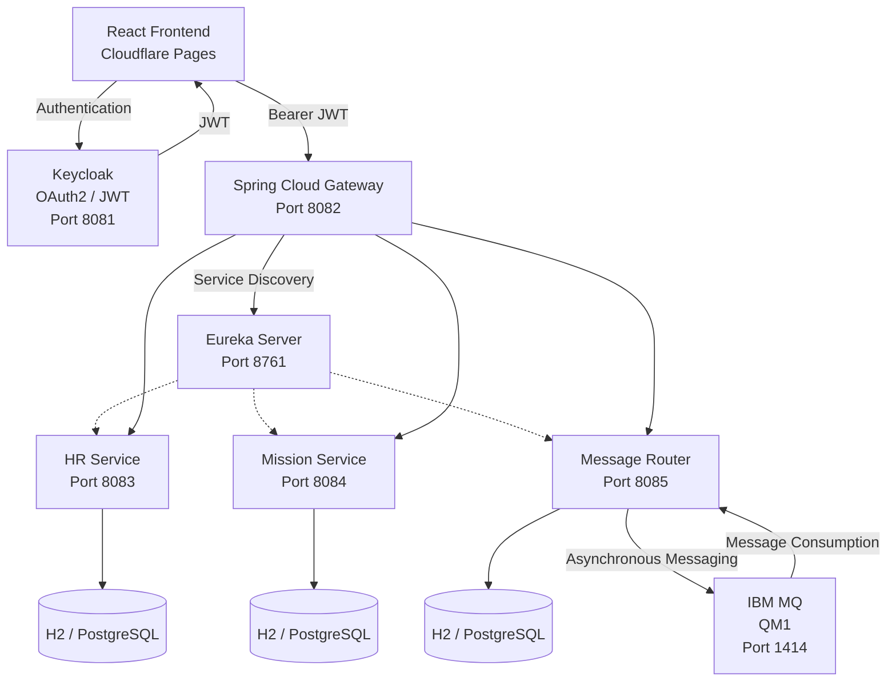

# 🏦 BankApp Microservices


> **Enterprise-oriented banking management platform built with Java, Spring Boot, Spring Cloud, OAuth2/JWT, Keycloak, IBM MQ, Docker, React and TypeScript.**

🌐 **Live Demo:**
https://cddd48c5.bankapp-frontend-606.pages.dev

💻 **Backend Repository:**
https://github.com/youssefJmaiel/bankapp-microservice

💻 **Frontend Repository:**
https://github.com/youssefJmaiel/bankapp-frontend

---

# 📌 Overview

**BankApp Microservices** is a full-stack enterprise-oriented banking management platform based on a **distributed microservices architecture**.

The project demonstrates how independent Java/Spring Boot services can be:

* secured with **Keycloak and OAuth2/JWT**
* discovered dynamically using **Netflix Eureka**
* accessed through a centralized **Spring Cloud Gateway**
* persisted using **H2 / PostgreSQL-ready configuration**
* integrated with **IBM MQ for asynchronous messaging**
* containerized with **Docker and Docker Compose**
* documented using **Swagger / OpenAPI**
* consumed by a modern **React + TypeScript frontend**

The project also implements **role-based access control (RBAC)** to distinguish administrative operations from user consultation and personal messaging.

---

# ✨ Main Features

## 🔐 Authentication & Security

* Keycloak authentication
* OAuth2 / JWT access tokens
* JWT validation in backend microservices
* Spring Security Resource Server
* Role-based authorization
* Protected REST APIs
* Secure Gateway-to-microservice communication

---

## 👑 Role-Based Access Control

The application implements two main frontend roles:

### 👑 ADMIN

The administrator has full access to the management platform.

**Employees**

* View employees
* Add employees
* Edit employees
* Delete employees

**Departments**

* View departments
* Add departments
* Edit departments
* Delete departments

**Missions**

* View missions
* Add missions
* Edit missions
* Delete missions
* Assign missions to employees

**Partners**

* View partners
* Add partners
* Delete partners

**Messages**

* View all banking messages
* Send banking messages
* Delete messages
* Access IBM MQ messaging functionality

---

### 👤 USER

The standard user has **consultation access** to the business modules.

The USER can:

* View employees
* View departments
* View missions
* View partners
* View assigned employee information
* Access the personal messaging inbox
* Read messages addressed to their username

The USER cannot:

* Add employees
* Edit employees
* Delete employees
* Add/edit/delete departments
* Create or modify missions
* Delete missions
* Add/delete partners
* Send banking messages
* Delete messages
* Access the administrative IBM MQ message-management interface

### 📬 Personal Message Inbox

A dedicated endpoint allows authenticated users to retrieve only the messages addressed to them:

```text
GET /api/messages/my
```

The backend extracts the authenticated user's:

```text
preferred_username
```

from the JWT and returns only messages where:

```text
receiver = authenticated username
```

This prevents a standard user from accessing the complete administrative message list.

---

# 🏗️ Architecture



---

# 🔄 End-to-End Request Flow

```text
React Frontend
      │
      ▼
  Keycloak
      │
      │ JWT
      ▼
Spring Cloud Gateway
      │
      ▼
    Eureka
      │
      ├───────────────┐
      ▼               ▼
 HR Service      Mission Service
      │
      │
      └───────────────┐
                      ▼
                Message Router
                      │
                      ▼
                   IBM MQ
```

---

# 🔐 Authentication Flow

```text
User
  │
  ▼
Keycloak
  │
  │ OAuth2 / JWT
  ▼
React Frontend
  │
  │ Authorization: Bearer <JWT>
  ▼
Spring Cloud Gateway
  │
  ▼
Downstream Microservice
```

Keycloak provides centralized identity management and JWT tokens.

The backend validates the JWT before allowing access to protected resources.

---

# 📸 Application Screenshots

The following screenshots demonstrate the main application features and authentication flow.

---

## 🔐 1. Keycloak Authentication


The application uses **Keycloak** as the centralized identity and access management system.

---

## 🏦 2. Banking Dashboard


The main dashboard provides access to the different business modules according to the authenticated user's role.

---

# 👥 Employee Management

## 3. Employees


The employee management interface provides access to employee information.

ADMIN users can perform management operations while USER users have consultation access.

## 4. Add Employee


Employee creation is restricted to ADMIN users.

---

# 🏢 Department Management

## 5. Departments


Departments are managed through the HR microservice.

## 6. Add Department


Creating departments is an administrative operation available to ADMIN users.

---

# 🎯 Mission Management

## 12. Mission Consultation


The Mission Management interface allows authenticated users to consult available missions.

Users can also access the employee associated with a mission when permitted by the backend authorization rules.

## 13. Add Mission


ADMIN users can create and assign missions to employees.

The frontend sends the mission information to the Mission Service through the API Gateway.

---

# 📨 Banking Messages

## 7. Messages


The messaging interface provides access to banking messages.

### ADMIN

ADMIN users can:

* View all messages
* Send messages
* Delete messages
* Access the IBM MQ messaging workflow

### USER

USER users have a personal inbox and can retrieve only messages addressed to their account.

The frontend calls:

```text
GET /api/messages/my
```

instead of the administrative:

```text
GET /api/messages
```

This provides proper separation between administrative and personal messaging access.

---

## 8. Send Banking Message


Sending banking messages is restricted to ADMIN users.

The message is persisted and then routed through the Message Router toward IBM MQ for asynchronous processing.

---

# 🤝 Partner Management

## 9. Partners


The Partner Management functionality is provided through the Message Router.

## 10. Add Partner


Partner creation is restricted to ADMIN users.

## 11. Partners Empty State


The application also provides a clean empty-state interface when no partners are available.

---

# 📨 IBM MQ — Asynchronous Messaging

The **Message Router** integrates IBM MQ to demonstrate enterprise asynchronous messaging.

```text
React Frontend
      │
      ▼
API Gateway
      │
      ▼
Message Router
      │
      ├── Database
      │
      ▼
   IBM MQ
      │
      ├── DEV.QUEUE.1
      └── DEV.QUEUE.2
```

The Message Router contains components responsible for:

* MQ connection configuration
* Message production
* Message consumption
* Queue listeners
* JSON serialization/deserialization
* Message routing
* Exception handling
* Message persistence

The project demonstrates the combination of:

```text
Synchronous REST APIs
          +
Asynchronous IBM MQ Messaging
```

---

# 📬 Message Processing Flow

```text
ADMIN
  │
  │ Send Banking Message
  ▼
React Frontend
  │
  ▼
API Gateway
  │
  ▼
Message Router
  │
  ├── Persist Message
  │
  ▼
IBM MQ
  │
  ▼
MQ Listener
  │
  ▼
Message Processing
```

For a USER:

```text
USER
 │
 ▼
React Frontend
 │
 ▼
API Gateway
 │
 ▼
Message Router
 │
 ▼
/api/messages/my
 │
 ▼
Messages addressed to USER
```

---

# 🔎 Service Discovery — Eureka

Netflix Eureka provides dynamic service registration and discovery.

```text
                    Eureka
                     :8761
                       │
          ┌────────────┼────────────┐
          ▼            ▼            ▼
      HR Service    Mission     Message Router
        :8083        :8084          :8085
```

The Gateway communicates with services using logical service identifiers:

```text
HR-SERVICE
MISSION-SERVICE
MESSAGE-ROUTER
```

This avoids hard-coded backend service addresses in the Gateway routing configuration.

---

# 🌐 API Gateway

Spring Cloud Gateway provides a centralized entry point for frontend requests.

### Gateway Routes

```text
/api/employees/**  → HR-SERVICE
/api/missions/**   → MISSION-SERVICE
/api/messages/**   → MESSAGE-ROUTER
/api/partners/**   → MESSAGE-ROUTER
```

The Gateway uses Eureka and Spring Cloud LoadBalancer:

```text
lb://HR-SERVICE
lb://MISSION-SERVICE
lb://MESSAGE-ROUTER
```

---

# 🔐 Security Architecture

Authentication and authorization are implemented using:

* Keycloak
* OAuth2
* JWT
* Spring Security
* OAuth2 Resource Server

### Roles

```text
ADMIN
AUDITOR
USER
```

The current frontend access-control implementation focuses on:

```text
ADMIN
USER
```

### JWT

Authenticated requests use:

```http
Authorization: Bearer <JWT_TOKEN>
```

The backend validates the token and applies role-based authorization using Spring Security.

---

# 🛡️ Role-Based Authorization Matrix

| Feature               | ADMIN | USER |
| --------------------- | :---: | :--: |
| Dashboard             |   ✅   |   ✅  |
| View Employees        |   ✅   |   ✅  |
| Add Employee          |   ✅   |   ❌  |
| Edit Employee         |   ✅   |   ❌  |
| Delete Employee       |   ✅   |   ❌  |
| View Departments      |   ✅   |   ✅  |
| Add Department        |   ✅   |   ❌  |
| Edit Department       |   ✅   |   ❌  |
| Delete Department     |   ✅   |   ❌  |
| View Missions         |   ✅   |   ✅  |
| Add Mission           |   ✅   |   ❌  |
| Edit Mission          |   ✅   |   ❌  |
| Delete Mission        |   ✅   |   ❌  |
| View Partners         |   ✅   |   ✅  |
| Add Partner           |   ✅   |   ❌  |
| Delete Partner        |   ✅   |   ❌  |
| View All Messages     |   ✅   |   ❌  |
| View Personal Inbox   |   ✅   |   ✅  |
| Send Message          |   ✅   |   ❌  |
| Delete Message        |   ✅   |   ❌  |
| IBM MQ Administration |   ✅   |   ❌  |

> **Backend authorization remains the source of truth.** Frontend role-based visibility improves the user experience, while protected backend endpoints enforce the actual permissions.

---

# 🧾 Technology Stack

| Layer             | Technology              | Details            |
| ----------------- | ----------------------- | ------------------ |
| Backend Language  | Java                    | 17                 |
| Backend Framework | Spring Boot             | 2.7.17             |
| Cloud             | Spring Cloud            | Gateway / Eureka   |
| Service Discovery | Netflix Eureka          | Dynamic discovery  |
| Security          | Keycloak                | OAuth2 / JWT       |
| Authentication    | OAuth2 Resource Server  | JWT                |
| Authorization     | Spring Security         | RBAC               |
| Messaging         | IBM MQ                  | QM1                |
| Database          | H2                      | Development        |
| Database          | PostgreSQL              | Production-ready   |
| Build             | Maven                   | 3.8+               |
| Containers        | Docker / Docker Compose | Containerization   |
| Frontend          | React                   | Modern SPA         |
| Frontend Language | TypeScript              | Type-safe frontend |
| API Documentation | Swagger / OpenAPI       | REST documentation |
| Deployment        | Cloudflare Pages        | Frontend           |

---

# 📦 Microservices

| Service             |   Port | Responsibility                                |
| ------------------- | -----: | --------------------------------------------- |
| **API Gateway**     | `8082` | Central API entry point, routing and security |
| **Auth Service**    |      — | Authentication-related backend integration    |
| **HR Service**      | `8083` | Employees and departments                     |
| **Mission Service** | `8084` | Mission management                            |
| **Message Router**  | `8085` | Messages, partners and IBM MQ integration     |
| **Eureka Server**   | `8761` | Service discovery                             |
| **Keycloak**        | `8081` | Identity and access management                |
| **IBM MQ**          | `1414` | Asynchronous messaging                        |

---

# 🗄️ Data Persistence

The project uses H2 for development and is prepared for PostgreSQL-based deployment.

| Environment              | Database         |
| ------------------------ | ---------------- |
| Development              | H2               |
| Production configuration | PostgreSQL-ready |

The different services maintain their own domain data.

### Message Router

Persists:

* Messages
* Partners

### HR Service

Persists:

* Employees
* Departments

### Mission Service

Persists:

* Missions
* Employee assignments

---

# 🐳 Docker & Docker Compose

The backend infrastructure is containerized using Docker.

Main services include:

```text
auth-service
discovery-server
gateway-service
hr-service
message-router
mission-service
```

The complete environment can be orchestrated using:

```text
docker-compose.yml
```

Example:

```bash
docker compose up --build
```

---

# ⚙️ Environment Configuration

Sensitive configuration is provided through environment variables.

Example:

```env
KEYCLOAK_CLIENT_SECRET=your_keycloak_client_secret
MQ_USER_IBM=your_mq_user
MQ_PASSWORD_IBM=your_mq_password
MQ_APP_PASSWORD=your_mq_app_password
```

The real `.env` file is excluded from Git.

```gitignore
.env
target/
```

An example configuration is provided through:

```text
.env.example
```

> ⚠️ **Never commit real credentials, passwords, access tokens or client secrets to the repository.**

---

# 🌐 Frontend

The frontend is implemented using:

* React
* TypeScript
* Vite
* Tailwind CSS
* Keycloak
* OAuth2 / JWT
* REST API integration

The frontend communicates with the backend through the API Gateway.

```text
React
  │
  ▼
Keycloak Authentication
  │
  ▼
JWT
  │
  ▼
API Gateway
  │
  ▼
Microservices
```

---

# ☁️ Deployment

The frontend is deployed using **Cloudflare Pages**.

```text
React + TypeScript
        │
        ▼
   Cloudflare Pages
        │
        ▼
   API Gateway
        │
        ▼
  Spring Microservices
```

Live frontend:

**https://cddd48c5.bankapp-frontend-606.pages.dev**

> The live environment depends on the availability and configuration of the backend infrastructure and Keycloak authentication.

---

# 📚 API Documentation

The backend exposes REST APIs documented with **Swagger / OpenAPI**.

Example:

```text
http://localhost:8083/swagger-ui/index.html
```

The main API Gateway is available at:

```text
http://localhost:8082
```

---

# 🌐 Backend Endpoints

| Component         | URL                                           |
| ----------------- | --------------------------------------------- |
| API Gateway       | `http://localhost:8082`                       |
| HR Service        | `http://localhost:8083/api/employees`         |
| Mission Service   | `http://localhost:8084/api/missions`          |
| Message Router    | `http://localhost:8085/api/messages`          |
| Personal Messages | `http://localhost:8085/api/messages/my`       |
| Partners          | `http://localhost:8085/api/partners`          |
| Eureka            | `http://localhost:8761`                       |
| Keycloak          | `http://localhost:8081`                       |
| Swagger UI        | `http://localhost:8083/swagger-ui/index.html` |

For normal frontend communication, requests are intended to go through the **API Gateway**.

---

# 🧪 Testing & Validation

The project includes unit tests for business logic and has been validated through authentication, authorization and integration scenarios.

### Security validation

| Scenario                       | Result             |
| ------------------------------ | ------------------ |
| Valid JWT                      | `200 OK`           |
| Missing JWT                    | `401 Unauthorized` |
| JWT authentication             | ✅ Validated        |
| ADMIN role                     | ✅ Supported        |
| USER role                      | ✅ Supported        |
| Gateway → HR with JWT          | `200 OK`           |
| USER → Personal Messages       | `200 OK`           |
| USER → Administrative Messages | ❌ Forbidden        |
| USER → Send Message            | ❌ Forbidden        |
| ADMIN → Send Message           | ✅ Allowed          |

### Maven Tests

Run:

```bash
./mvnw test
```

or:

```bash
mvn test
```

---

# 📁 Project Structure

```text
bankapp-microservice/
│
├── auth-service/
├── bankapp-platform/
├── career-service/
├── common/
├── config-server/
├── discovery-server/
├── gateway-service/
├── hr-service/
├── message-router/
├── mission-service/
├── partner-service/
│
├── docs/
│   └── screenshots/
│       ├── 01-keycloak-login.png
│       ├── 02-dashboard.png
│       ├── 03-employees.png
│       ├── 04-add-employee.png
│       ├── 05-departments.png
│       ├── 06-add-department.png
│       ├── 07-messages.png
│       ├── 08-send-banking-message.png
│       ├── 09-partners.png
│       ├── 10-add-partner.png
│       ├── 11-partners-empty-state.png
│       ├── 12-missions.png
│       └── 13-add-mission.png
│
├── docker-compose.yml
├── .env.example
├── .gitignore
└── README.md
```

---

# 🔄 Main Technical Concepts Demonstrated

## Microservices

Independent services with separated business responsibilities.

## API Gateway

Centralized routing between the frontend and backend services.

## Service Discovery

Dynamic registration and discovery using Eureka.

## OAuth2 / JWT

Token-based authentication and authorization.

## Keycloak

Centralized identity and access management.

## Role-Based Authorization

Different application permissions based on authenticated roles.

```text
ADMIN
USER
```

## REST APIs

Communication between the frontend, Gateway and backend services.

## Asynchronous Messaging

IBM MQ for enterprise asynchronous message processing.

## Persistence

H2 for development with PostgreSQL-ready configuration.

## Containerization

Docker and Docker Compose for infrastructure management.

## API Documentation

Swagger / OpenAPI for REST API documentation.

## Automated Testing

Unit tests for service-layer business logic.

---

# 🎯 Project Objectives

The main objective of **BankApp Microservices** is to demonstrate the design and implementation of an enterprise-oriented distributed application using technologies commonly found in professional Java backend environments.

The project focuses on:

* Microservices architecture
* Separation of business responsibilities
* Secure API communication
* Centralized authentication
* OAuth2 / JWT
* Role-based authorization
* API Gateway routing
* Dynamic service discovery
* REST APIs
* Asynchronous messaging
* IBM MQ integration
* Database persistence
* Docker containerization
* API documentation
* Unit testing
* Frontend/backend integration
* Cloud deployment

---

# 💼 What This Project Demonstrates

From a software engineering perspective, the project demonstrates practical implementation of:

```text
Java 17
   │
   ├── Spring Boot
   ├── Spring Security
   ├── Spring Cloud
   │      ├── Gateway
   │      └── Eureka
   │
   ├── OAuth2 / JWT
   ├── Keycloak
   ├── REST APIs
   ├── IBM MQ
   ├── H2 / PostgreSQL
   ├── Docker
   ├── Maven
   └── Swagger / OpenAPI
```

The frontend complements the backend architecture with:

```text
React
   │
   ├── TypeScript
   ├── Vite
   ├── Tailwind CSS
   ├── Keycloak Authentication
   ├── OAuth2 / JWT
   ├── REST API Integration
   └── Cloudflare Pages
```

---

# 🚀 Key Achievements

### Backend

* Designed a distributed Spring Boot microservices architecture
* Implemented Spring Cloud Gateway
* Implemented Eureka service discovery
* Integrated Keycloak
* Implemented OAuth2 / JWT security
* Implemented role-based authorization
* Integrated IBM MQ
* Implemented synchronous REST and asynchronous messaging
* Added H2 persistence
* Prepared PostgreSQL configuration
* Containerized backend services with Docker
* Added Swagger / OpenAPI documentation
* Implemented unit testing

### Frontend

* Built a React + TypeScript banking management interface
* Integrated Keycloak authentication
* Implemented JWT-based authentication
* Implemented ADMIN / USER role-based UI
* Added employee management
* Added department management
* Added mission management
* Added partner management
* Added banking messaging
* Implemented personal USER message inbox
* Hid administrative operations from standard users
* Integrated frontend with the API Gateway
* Deployed frontend using Cloudflare Pages

### Security & Authorization

The application follows a **defense-in-depth authorization approach**:

```text
Frontend Role-Based UI
        +
Backend Spring Security
        +
Keycloak JWT
        =
Protected Enterprise Application
```

Frontend restrictions improve usability, while backend authorization prevents unauthorized API access.

---

# 🌐 Live Application

The React frontend is available online:

**https://cddd48c5.bankapp-frontend-606.pages.dev**

Authentication is handled through Keycloak.

> The live environment may depend on the availability of the backend infrastructure and authentication configuration.

---

# 👨‍💻 Author

## Youssef Jmaiel

**Computer Science Engineer**

Focused on:

**Java Backend · Spring Boot · Microservices · Full-Stack Development**

### GitHub

https://github.com/youssefJmaiel

### LinkedIn

https://linkedin.com/in/youssef-jmaiel

### Backend Project

https://github.com/youssefJmaiel/bankapp-microservice

### Frontend Project

https://github.com/youssefJmaiel/bankapp-frontend

---

# 📜 License

This project is licensed under the **MIT License**.
