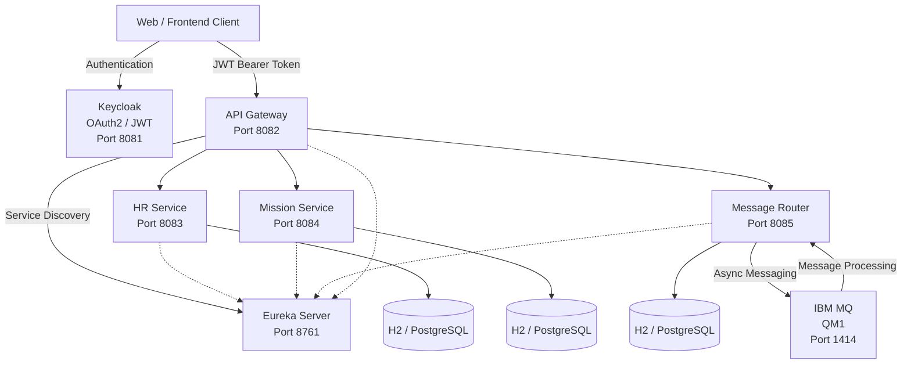

# 🏦 BankApp Microservices


> **Enterprise-oriented banking backend built with Java, Spring Boot, Spring Cloud, OAuth2/JWT, Keycloak, IBM MQ and Docker.**

BankApp Microservices is a modular banking management platform designed around a **distributed microservices architecture**.

The project demonstrates how independent Spring Boot services can be secured, discovered, routed and integrated through both **REST APIs and asynchronous IBM MQ messaging**.

The architecture is designed with concepts commonly used in enterprise Java environments: **API Gateway, service discovery, centralized authentication, role-based authorization, messaging, containerization, database persistence and API documentation**.

---

# 🚀 Project Highlights

* 🧩 **Microservices architecture** with independent Spring Boot services
* 🔐 **OAuth2 / JWT security** with Keycloak
* 👥 **Role-based authorization** with `ADMIN`, `AUDITOR` and `USER`
* 🌐 **Centralized API Gateway** using Spring Cloud Gateway
* 🔎 **Service discovery** using Netflix Eureka
* 📨 **IBM MQ integration** for asynchronous message processing
* 🐳 **Docker & Docker Compose** deployment
* 🗄️ **H2 for development / PostgreSQL for production**
* 📚 **Swagger / OpenAPI** API documentation
* 🧪 **Unit testing** for business services
* 🔄 REST communication between distributed services
* 🛡️ Centralized authentication and protected backend APIs
* ⚙️ Environment-based configuration using Docker environment variables

---

# 🏗️ Architecture



### Request Flow

```text
Client
   │
   │ JWT
   ▼
Keycloak
   │
   ▼
API Gateway
   │
   ├──► HR Service
   │
   ├──► Mission Service
   │
   └──► Message Router
                  │
                  ▼
               IBM MQ
```

---

# 📦 Microservices

| Service             |   Port | Responsibility                             |
| ------------------- | -----: | ------------------------------------------ |
| **API Gateway**     | `8082` | Central entry point, routing and security  |
| **Auth Service**    |      — | Authentication-related backend integration |
| **HR Service**      | `8083` | Employees and departments management       |
| **Mission Service** | `8084` | Banking mission management                 |
| **Message Router**  | `8085` | Message routing and IBM MQ integration     |
| **Eureka Server**   | `8761` | Service discovery and registration         |
| **IBM MQ**          | `1414` | Asynchronous enterprise messaging          |
| **Keycloak**        | `8081` | Identity management and JWT tokens         |

---

# 🌐 API Gateway

The Gateway provides a **single entry point** to the backend.

Instead of exposing every microservice directly to the client, requests are routed through the Gateway.

### Current Routes

```text
/api/employees/**  → HR-SERVICE
/api/missions/**   → MISSION-SERVICE
/api/messages/**   → MESSAGE-ROUTER
/api/partners/**   → MESSAGE-ROUTER
```

Service discovery is performed through Eureka using Spring Cloud LoadBalancer:

```text
lb://HR-SERVICE
lb://MISSION-SERVICE
lb://MESSAGE-ROUTER
```

This allows services to communicate using their logical service names rather than hard-coded container addresses.

---

# 🔐 Security

Security is implemented using **Keycloak + OAuth2 + JWT**.

### Authentication Flow

```text
User
 │
 ▼
Keycloak
 │
 │ JWT Access Token
 ▼
API Gateway
 │
 │ Validate JWT
 ▼
Protected Microservice
```

The application uses the following Keycloak configuration:

```text
Realm: spring-app
Client: spring-boot-client
```

### Roles

The project demonstrates role-based access control with:

```text
ADMIN
AUDITOR
USER
```

Protected endpoints require a Bearer token:

```http
Authorization: Bearer <JWT_TOKEN>
```

The Gateway acts as the first security layer while downstream services also contain their own Spring Security configuration.

---

# 📨 IBM MQ — Enterprise Messaging

One of the main technical components of the project is the integration with **IBM MQ**.

The Message Router service communicates with IBM MQ to support asynchronous message processing.

### Messaging Architecture

```text
REST Client
     │
     ▼
API Gateway
     │
     ▼
Message Router
     │
     ▼
IBM MQ
     │
     ├── DEV.QUEUE.1
     └── DEV.QUEUE.2
```

IBM MQ is integrated through the IBM MQ client libraries and Spring-based messaging configuration.

The Message Router contains dedicated components for:

* MQ connection configuration
* Message production
* Message consumption
* Queue listeners
* JSON message serialization/deserialization
* Message routing
* Exception handling

This demonstrates the combination of **synchronous REST communication** with **asynchronous enterprise messaging**.

---

# 🔎 Service Discovery

The application uses **Netflix Eureka** for service registration and discovery.

```text
                 Eureka
                :8761
                  │
        ┌─────────┼─────────┐
        ▼         ▼         ▼
    HR Service  Mission   Message
               Service    Router
```

Services register themselves with Eureka and the API Gateway discovers them dynamically.

This avoids coupling the Gateway to fixed service IP addresses.

---

# 🗄️ Data Persistence

The services are designed to support different database environments.

### Development

```text
H2 Database
```

### Production

```text
PostgreSQL
```

The Message Router also persists its domain data and supports entities such as:

* Messages
* Partners

This separation makes the application easier to run locally while keeping a path toward production-oriented database infrastructure.

---

# 🐳 Docker

Each main microservice has its own Dockerfile.

The project includes:

```text
auth-service/Dockerfile
discovery-server/Dockerfile
gateway-service/Dockerfile
hr-service/Dockerfile
message-router/Dockerfile
mission-service/Dockerfile
```

The infrastructure is orchestrated using:

```text
docker-compose.yml
```

The Docker environment includes the main backend services together with the messaging infrastructure.

### Environment Variables

Sensitive configuration is provided through environment variables:

```text
KEYCLOAK_CLIENT_SECRET
MQ_USER_IBM
MQ_PASSWORD_IBM
MQ_APP_PASSWORD
```

Sensitive values are intentionally kept outside the Git repository.

The `.env` file is excluded from Git using `.gitignore`.

---

# ⚙️ Running the Project

## Prerequisites

Install the following tools before running the project:

* Java 17
* Maven 3.8+
* Git
* Docker
* Docker Compose

---

## 1. Clone the Repository

```bash
git clone https://github.com/youssefJmaiel/bankapp-microservice.git
cd bankapp-microservice
```

---

## 2. Configure Environment Variables

The repository provides an example environment file:

```text
.env.example
```

Create your local `.env` file:

```bash
cp .env.example .env
```

Then configure the required values:

```env
KEYCLOAK_CLIENT_SECRET=your_keycloak_client_secret
MQ_USER_IBM=your_mq_user
MQ_PASSWORD_IBM=your_mq_password
MQ_APP_PASSWORD=your_mq_app_password
```

> **Important:** Never commit your real `.env` file or passwords to GitHub.

---

## 3. Configure Keycloak

Start Keycloak and create/configure:

```text
Realm:
spring-app
```

```text
Client:
spring-boot-client
```

Configure the required roles:

```text
ADMIN
AUDITOR
USER
```

The application uses Keycloak to issue OAuth2/JWT access tokens used to access protected APIs.

---

## 4. Start the Docker Environment

Build and start the containerized infrastructure:

```bash
docker compose up --build
```

If your Docker installation uses the legacy command:

```bash
docker-compose up --build
```

Docker Compose starts the main backend infrastructure and messaging components defined in `docker-compose.yml`.

---

## 5. Verify Eureka

Open the Eureka dashboard:

```text
http://localhost:8761
```

The registered services should appear in the Eureka dashboard.

Expected services include:

```text
GATEWAY-SERVICE
HR-SERVICE
MISSION-SERVICE
MESSAGE-ROUTER
```

---

## 6. Access the Backend

### API Gateway

```text
http://localhost:8082
```

### HR Service

```text
http://localhost:8083/api/employees
```

### Mission Service

```text
http://localhost:8084/api/missions
```

### Message Router

```text
http://localhost:8085/api/messages
```

### Partners

```text
http://localhost:8085/api/partners
```

### Eureka

```text
http://localhost:8761
```

---

# 📚 API Documentation

The services expose Swagger / OpenAPI documentation.

Example:

```text
http://localhost:8083/swagger-ui/index.html
```

Swagger allows developers to inspect and test REST endpoints without manually building HTTP requests.

---

# 🧪 Testing

The project includes unit tests for backend business logic.

Example:

```text
message-router/src/test/
```

The Message Router service includes tests around its message service layer.

Run the Maven tests with:

```bash
mvn test
```

---

# 🛠️ Technology Stack

## Backend

* Java 17
* Spring Boot 2.7.17
* Spring Security
* Spring OAuth2 Resource Server
* Spring Cloud Gateway
* Spring Cloud Netflix Eureka
* Spring Data JPA
* Maven

## Security

* Keycloak
* OAuth2
* JWT
* Role-Based Access Control

## Messaging

* IBM MQ
* MQ queues
* Message listeners
* Asynchronous processing

## Database

* H2
* PostgreSQL

## DevOps / Infrastructure

* Docker
* Docker Compose
* Linux
* Environment-based configuration

## API

* REST
* Swagger
* OpenAPI
* JSON

---

# 📁 Project Structure

```text
bankapp-microservice/
│
├── auth-service/
│
├── bankapp-platform/
│
├── career-service/
│
├── common/
│
├── config-server/
│
├── discovery-server/
│
├── gateway-service/
│
├── hr-service/
│
├── message-router/
│
├── mission-service/
│
├── partner-service/
│
├── docker-compose.yml
├── .env.example
├── .gitignore
└── README.md
```

---

# 💡 Technical Concepts Demonstrated

```text
Microservices Architecture
        │
        ├── API Gateway
        ├── Service Discovery
        ├── OAuth2 / JWT
        ├── Role-Based Security
        ├── REST APIs
        ├── IBM MQ
        ├── Asynchronous Messaging
        ├── Database Persistence
        ├── Docker
        ├── Environment Configuration
        ├── Swagger / OpenAPI
        └── Unit Testing
```

The project combines multiple enterprise backend patterns rather than implementing a single monolithic Spring Boot application.

---

# 🎯 Project Goals

The main objective of BankApp Microservices is to demonstrate the design and implementation of a realistic distributed backend using technologies commonly found in enterprise Java environments.

The project focuses on:

* Separation of business responsibilities
* Secure API communication
* Independent service deployment
* Dynamic service discovery
* Centralized API routing
* Asynchronous messaging
* Containerized infrastructure
* Maintainable service structure
* Development-to-production database flexibility

---

# 👨‍💻 Author

**Youssef Jmaiel**

Computer Science Engineer focused on **Java Backend, Spring Boot and Microservices**.

### Technologies of Interest

```text
Java
Spring Boot
Spring Cloud
Microservices
REST APIs
OAuth2 / JWT
Keycloak
IBM MQ
Docker
PostgreSQL
```

### Links

* GitHub: https://github.com/youssefJmaiel
* Project: https://github.com/youssefJmaiel/bankapp-microservice

---

# 📜 License

This project is licensed under the MIT License.
