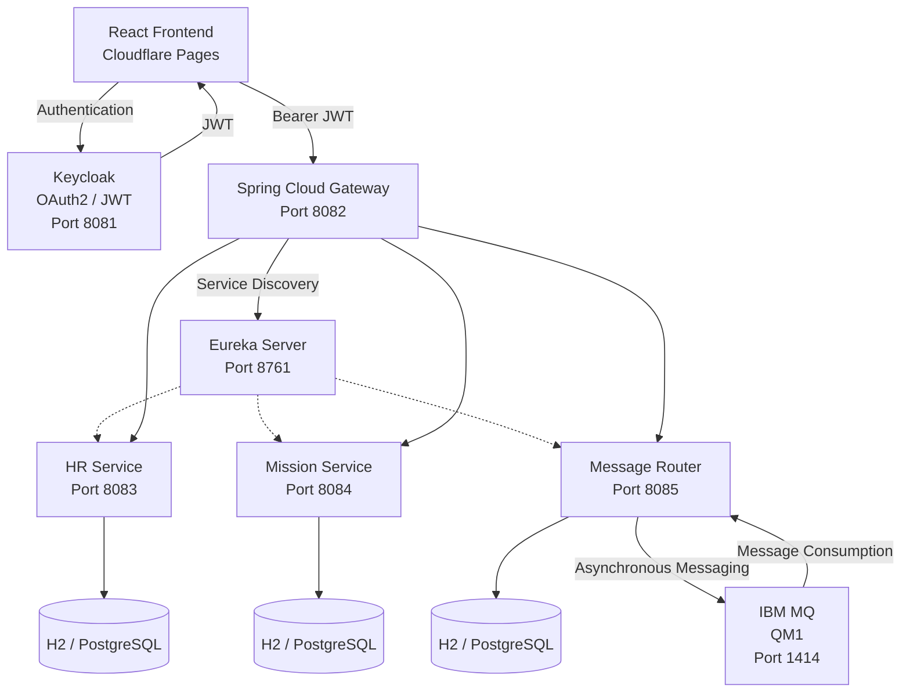

# 🏦 BankApp Microservices


> **Enterprise-oriented banking management platform built with Java, Spring Boot, Spring Cloud, OAuth2/JWT, Keycloak, IBM MQ and Docker, with a React frontend deployed on Cloudflare Pages.**

[🌐 **Live Demo**](https://cddd48c5.bankapp-frontend-606.pages.dev) · [💻 **GitHub Repository**](https://github.com/youssefJmaiel/bankapp-microservice)

> ℹ️ The frontend requires authentication through Keycloak. Demo credentials can be provided separately.

BankApp Microservices is a modular banking management application built around a **distributed microservices architecture**.

The project demonstrates how independent Spring Boot services can be **secured, discovered, routed and integrated** through REST APIs and asynchronous messaging with IBM MQ.

The architecture combines several enterprise Java concepts:

* Microservices
* API Gateway
* Service discovery
* OAuth2 / JWT authentication
* Role-based authorization
* REST APIs
* Asynchronous messaging
* Database persistence
* Docker containerization
* API documentation
* Unit testing

---

## 📸 Screenshots

The following screenshots show the main application features and authentication flow.

### 🔐 Authentication — Keycloak


The application uses Keycloak to authenticate users and issue OAuth2/JWT access tokens.

---

### 🏦 Banking Dashboard


The main dashboard provides access to the different business areas of the application.

---

### 👥 Employee Management

| Employees                                       | Add Employee                                          |
| ----------------------------------------------- | ----------------------------------------------------- |
|  |  |

The HR functionality allows users to view and manage employee information.

---

### 🏢 Department Management

| Departments                                         | Add Department                                            |
| --------------------------------------------------- | --------------------------------------------------------- |
|  |  |

Departments are managed through the HR service.

---

### 📨 Messaging

| Messages                                      | Send Banking Message                                                  |
| --------------------------------------------- | --------------------------------------------------------------------- |
|  |  |

Banking messages are handled by the Message Router and integrated with IBM MQ for asynchronous processing.

---

### 🤝 Partner Management

| Partners                                      | Add Partner                                         |
| --------------------------------------------- | --------------------------------------------------- |
|  |  |

The Message Router also exposes partner management functionality.

### Empty State


---

# 🏗️ Architecture



---

## 🔄 End-to-End Request Flow

```text
React Frontend
      │
      ▼
  Keycloak
      │
      │ JWT
      ▼
Spring Cloud Gateway
      │
      ▼
   Eureka
      │
 ┌────┼───────────────┐
 ▼    ▼               ▼
 HR  Mission    Message Router
                         │
                         ▼
                      IBM MQ
```

### Authentication flow

```text
User
  ↓
Keycloak
  ↓
JWT Access Token
  ↓
React Frontend
  ↓
Spring Cloud Gateway
  ↓
Downstream Microservice
```

### Banking message flow

```text
React
  ↓
Gateway
  ↓
Message Router
  ↓
Database
  ↓
IBM MQ
  ↓
MQ Listener
  ↓
Message Processing
```

---

# 🚀 Project Highlights

* 🧩 Modular **microservices architecture**
* ☕ **Java 17** backend
* 🌱 **Spring Boot 2.7.17**
* 🌐 **Spring Cloud Gateway**
* 🔎 **Netflix Eureka service discovery**
* 🔐 **Keycloak + OAuth2 / JWT**
* 👥 Role-based authorization with `ADMIN`, `AUDITOR` and `USER`
* 📨 **IBM MQ** asynchronous messaging
* 🐳 Docker and Docker Compose
* 🗄️ H2 database for development
* 🐘 PostgreSQL-ready configuration
* 📚 Swagger / OpenAPI documentation
* 🧪 Unit testing
* ⚙️ Environment-based configuration
* ⚛️ React + TypeScript frontend
* ☁️ Frontend deployment using Cloudflare Pages

---

# 🧾 Technology Stack

| Layer             | Technology              | Version / Details              |
| ----------------- | ----------------------- | ------------------------------ |
| Language          | Java                    | 17                             |
| Framework         | Spring Boot             | 2.7.17                         |
| Cloud             | Spring Cloud            | Gateway / Eureka               |
| Service Discovery | Netflix Eureka          | —                              |
| Security          | Keycloak                | OAuth2 / JWT                   |
| Authentication    | OAuth2 Resource Server  | JWT                            |
| Messaging         | IBM MQ                  | QM1                            |
| Database          | H2                      | Development                    |
| Database          | PostgreSQL              | Production-ready configuration |
| Build             | Maven                   | 3.8+                           |
| Containers        | Docker / Docker Compose | —                              |
| Frontend          | React / TypeScript      | —                              |
| API Documentation | Swagger / OpenAPI       | —                              |
| Deployment        | Cloudflare Pages        | Frontend                       |

---

# 📦 Microservices

| Service             |   Port | Responsibility                                |
| ------------------- | -----: | --------------------------------------------- |
| **API Gateway**     | `8082` | Central API entry point, routing and security |
| **Auth Service**    |      — | Authentication-related backend integration    |
| **HR Service**      | `8083` | Employees and departments                     |
| **Mission Service** | `8084` | Mission management                            |
| **Message Router**  | `8085` | Messages, partners and IBM MQ integration     |
| **Eureka Server**   | `8761` | Service discovery                             |
| **IBM MQ**          | `1414` | Asynchronous enterprise messaging             |
| **Keycloak**        | `8081` | Identity and access management                |

---

# 🌐 API Gateway

The Spring Cloud Gateway provides a centralized entry point for frontend requests.

### Gateway routes

```text
/api/employees/**  → HR-SERVICE
/api/missions/**   → MISSION-SERVICE
/api/messages/**   → MESSAGE-ROUTER
/api/partners/**   → MESSAGE-ROUTER
```

The Gateway uses Eureka service discovery and Spring Cloud LoadBalancer.

```text
lb://HR-SERVICE
lb://MISSION-SERVICE
lb://MESSAGE-ROUTER
```

This allows the Gateway to route requests using logical service names rather than hard-coded service IP addresses.

---

# 🔐 Security

Authentication and authorization are implemented with **Keycloak, OAuth2 and JWT**.

### Keycloak configuration

```text
Realm:  spring-app
Client: spring-boot-client
Roles:  ADMIN
        AUDITOR
        USER
```

Authenticated requests use:

```http
Authorization: Bearer <JWT_TOKEN>
```

### Security architecture

```text
React Frontend
      │
      │ Authentication
      ▼
  Keycloak
      │
      │ JWT
      ▼
Spring Cloud Gateway
      │
      ▼
Downstream Services
```

The Gateway validates incoming JWT tokens before routing requests to protected backend services.

The downstream services also use Spring Security for resource-server authentication.

---

## 🛡️ Security Validation

The authentication flow has been tested using Keycloak-issued JWT tokens.

| Scenario                 | Result             |
| ------------------------ | ------------------ |
| Valid JWT                | `200 OK`           |
| Missing JWT              | `401 Unauthorized` |
| JWT-based authentication | Validated          |
| `ADMIN` role             | Supported          |
| `AUDITOR` role           | Supported          |
| `USER` role              | Supported          |
| Gateway → HR with JWT    | `200 OK`           |

No credentials, access tokens or secrets are stored in the repository.

---

# 📨 IBM MQ — Asynchronous Messaging

The Message Router integrates IBM MQ to support asynchronous message processing.

```text
REST Client
     │
     ▼
API Gateway
     │
     ▼
Message Router
     │
     ├── Database
     │
     ▼
  IBM MQ
     │
     ├── DEV.QUEUE.1
     └── DEV.QUEUE.2
```

The Message Router contains components responsible for:

* MQ connection configuration
* Message production
* Message consumption
* Queue listeners
* JSON serialization/deserialization
* Message routing
* Exception handling
* Message persistence

This demonstrates the combination of:

```text
Synchronous REST APIs
          +
Asynchronous IBM MQ messaging
```

---

# 🔎 Service Discovery — Eureka

Eureka provides service registration and discovery.

```text
                    Eureka
                    :8761
                       │
          ┌────────────┼────────────┐
          ▼            ▼            ▼
      HR Service    Mission     Message Router
        :8083       Service         :8085
                     :8084
```

The Gateway communicates with services through logical service identifiers:

```text
HR-SERVICE
MISSION-SERVICE
MESSAGE-ROUTER
```

This avoids hard-coded backend service addresses in the Gateway routing configuration.

---

# 🗄️ Data Persistence

The project currently uses H2 for development and is prepared for PostgreSQL-based deployment.

| Environment              | Database         |
| ------------------------ | ---------------- |
| Development              | H2               |
| Production configuration | PostgreSQL-ready |

The Message Router persists domain information including:

* Messages
* Partners

The HR and Mission services also maintain their respective domain data.

---

# 🐳 Docker & Docker Compose

The main backend components are containerized using Docker.

Example Dockerfiles:

```text
auth-service/Dockerfile
discovery-server/Dockerfile
gateway-service/Dockerfile
hr-service/Dockerfile
message-router/Dockerfile
mission-service/Dockerfile
```

The complete environment can be orchestrated with:

```text
docker-compose.yml
```

### Environment variables

Sensitive configuration is provided through environment variables:

```text
KEYCLOAK_CLIENT_SECRET
MQ_USER_IBM
MQ_PASSWORD_IBM
MQ_APP_PASSWORD
```

The real `.env` file is excluded from Git using `.gitignore`.

An example configuration is provided through:

```text
.env.example
```

Example:

```env
KEYCLOAK_CLIENT_SECRET=your_keycloak_client_secret
MQ_USER_IBM=your_mq_user
MQ_PASSWORD_IBM=your_mq_password
MQ_APP_PASSWORD=your_mq_app_password
```

> **Important:** Never commit the real `.env` file or any credentials to the repository.

---

# ⚙️ Running the Project

## Prerequisites

Install:

* Java 17
* Maven 3.8+
* Git
* Docker
* Docker Compose

---

## 1. Clone the repository

```bash
git clone https://github.com/youssefJmaiel/bankapp-microservice.git
cd bankapp-microservice
```

---

## 2. Configure environment variables

Create the local environment file:

```bash
cp .env.example .env
```

Then configure the required values:

```env
KEYCLOAK_CLIENT_SECRET=your_keycloak_client_secret
MQ_USER_IBM=your_mq_user
MQ_PASSWORD_IBM=your_mq_password
MQ_APP_PASSWORD=your_mq_app_password
```

---

## 3. Configure Keycloak

Create the following Keycloak configuration:

```text
Realm:
spring-app

Client:
spring-boot-client

Roles:
ADMIN
AUDITOR
USER
```

Configure the client according to the authentication flow used by the application.

---

## 4. Start the backend environment

```bash
docker compose up --build
```

For older Docker installations:

```bash
docker-compose up --build
```

---

## 5. Verify the containers

```bash
docker compose ps
```

Expected backend components include:

```text
GATEWAY-SERVICE
HR-SERVICE
MISSION-SERVICE
MESSAGE-ROUTER
DISCOVERY-SERVER
```

Keycloak and IBM MQ are also required for the complete environment.

---

## 6. Verify Eureka

Open:

```text
http://localhost:8761
```

The Gateway should be able to discover the registered backend services.

---

## 7. Verify Gateway security

A protected endpoint without authentication should return:

```text
401 Unauthorized
```

Example:

```bash
curl -i http://localhost:8082/api/employees
```

---

# 🌐 Backend Endpoints

| Component       | URL                                           |
| --------------- | --------------------------------------------- |
| API Gateway     | `http://localhost:8082`                       |
| HR Service      | `http://localhost:8083/api/employees`         |
| Mission Service | `http://localhost:8084/api/missions`          |
| Message Router  | `http://localhost:8085/api/messages`          |
| Partners        | `http://localhost:8085/api/partners`          |
| Eureka          | `http://localhost:8761`                       |
| Keycloak        | `http://localhost:8081`                       |
| Swagger UI      | `http://localhost:8083/swagger-ui/index.html` |

For normal frontend communication, requests are intended to go through the **API Gateway**.

---

# 📚 API Documentation

Swagger / OpenAPI is used to document backend REST APIs.

Example:

```text
http://localhost:8083/swagger-ui/index.html
```

Other services expose their own API documentation depending on their configuration.

---

# 🧪 Testing

The project includes unit tests for business logic.

Run the Maven test suite with:

```bash
./mvnw test
```

or:

```bash
mvn test
```

Example test location:

```text
message-router/src/test/
```

Testing focuses on service-layer business logic and application behavior.

---

# 📁 Project Structure

```text
bankapp-microservice/
│
├── auth-service/
├── bankapp-platform/
├── career-service/
├── common/
├── config-server/
├── discovery-server/
├── gateway-service/
├── hr-service/
├── message-router/
├── mission-service/
├── partner-service/
│
├── docs/
│   └── screenshots/
│       ├── 01-keycloak-login.png
│       ├── 02-dashboard.png
│       ├── 03-employees.png
│       ├── 04-add-employee.png
│       ├── 05-departments.png
│       ├── 06-add-department.png
│       ├── 07-messages.png
│       ├── 08-send-banking-message.png
│       ├── 09-partners.png
│       ├── 10-add-partner.png
│       └── 11-partners-empty-state.png
│
├── docker-compose.yml
├── .env.example
├── .gitignore
└── README.md
```

---

# 🔄 Main Technical Concepts Demonstrated

This project was developed to practice and demonstrate the following backend and distributed-system concepts:

### Microservices

Independent services with separated business responsibilities.

### API Gateway

Centralized routing between the frontend and backend services.

### Service Discovery

Dynamic service registration and discovery using Eureka.

### OAuth2 / JWT

Token-based authentication and authorization.

### Keycloak

Centralized identity and access management.

### Role-Based Authorization

Application roles:

```text
ADMIN
AUDITOR
USER
```

### REST APIs

Communication between the frontend, Gateway and backend services.

### Asynchronous Messaging

IBM MQ for asynchronous enterprise message processing.

### Persistence

H2 for development with PostgreSQL-ready configuration.

### Containerization

Docker and Docker Compose for service deployment and infrastructure management.

### API Documentation

Swagger / OpenAPI for REST API documentation.

### Automated Testing

Unit tests for service-layer business logic.

---

# 🎯 Project Objectives

The main objective of BankApp Microservices is to implement and demonstrate a distributed backend using technologies commonly used in **enterprise Java development**.

The project focuses on:

* Separation of business responsibilities
* Secure API communication
* Centralized authentication
* Role-based authorization
* API Gateway routing
* Dynamic service discovery
* REST-based service communication
* Asynchronous messaging
* Database persistence
* Containerized infrastructure
* Maintainable service structure
* API documentation
* Unit testing
* Development-to-production database flexibility

---

# 💼 What This Project Demonstrates

From a software engineering perspective, the project demonstrates practical experience with:

```text
Java
  │
  ├── Spring Boot
  ├── Spring Security
  ├── Spring Cloud
  │      ├── Gateway
  │      └── Eureka
  │
  ├── OAuth2 / JWT
  ├── Keycloak
  ├── REST APIs
  ├── IBM MQ
  ├── H2 / PostgreSQL
  ├── Docker
  ├── Maven
  └── Swagger / OpenAPI
```

The frontend complements the backend architecture with:

```text
React
TypeScript
REST API integration
Keycloak authentication
Cloudflare Pages deployment
```

---

# 🌐 Live Application

The React frontend is available online:

**https://cddd48c5.bankapp-frontend-606.pages.dev**

The frontend communicates with the backend through the configured API Gateway.

Authentication is handled through Keycloak.

> The live environment may depend on the availability of the backend infrastructure and authentication configuration.

---

# 👨‍💻 Author

**Youssef Jmaiel**

Computer Science Engineer focused on:

**Java Backend · Spring Boot · Microservices**

### GitHub

https://github.com/youssefJmaiel

### Project

https://github.com/youssefJmaiel/bankapp-microservice

---

# 📜 License

This project is licensed under the **MIT License**.
